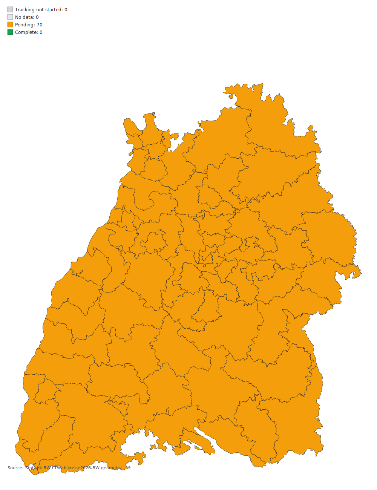

# Landtagswahl Baden-Wuerttemberg 2026 - Tracking Template

## Tracking Window

Automated tracking is scheduled to commence at **2026-03-08 18:00 CET**.
No official results are expected before **2026-03-08 18:00 CET**, so polling is intentionally disabled until then.

## Data Sources (Planned)

- `komm.one` municipality APIs (template: `https://wahlergebnisse.komm.one/lb/produktion/wahltermin-{wahltermin}/{ags}` + `/daten/api/...`)
- Statistik BW single CSV: `https://www.statistik-bw.de/fileadmin/user_upload/Wahlen/Landesdaten/ltw26_daten.csv` (fallback: `https://www.statistik-bw.de/fileadmin/user_upload/Presse/Pressemitteilungen/2026021_LTW26-Dummy-Datei.csv`)
- Wahlkreis geometry (GeoJSON ZIP): `https://www.statistik-bw.de/fileadmin/user_upload/medien/bilder/Karten_und_Geometrien_der_Wahlkreise/LTWahlkreise2026-BW_GEOJSON.zip`
- Wahlkreis geometry (SHP ZIP): `https://www.statistik-bw.de/fileadmin/user_upload/medien/bilder/Karten_und_Geometrien_der_Wahlkreise/LTWahlkreise2026-BW_SHP.zip`

## Wahlkreis Map

Map file and status table are prepared from official published geometry in `data/ltw26/metadata/`.

## Party Totals (First and Second Votes)

### Erststimmen

| Party | `komm.one` Count | `komm.one` Share | `statla` Count | `statla` Share | Delta Count (`komm.one`-`statla`) | Delta Share (`komm.one`-`statla`) |
|---|---:|---:|---:|---:|---:|---:|
| D1 | 0 | 0.00% | 0 | 0.00% | +0 | +0.00% |
| D2 | 0 | 0.00% | 0 | 0.00% | +0 | +0.00% |
| D3 | 0 | 0.00% | 0 | 0.00% | +0 | +0.00% |
| D4 | 0 | 0.00% | 0 | 0.00% | +0 | +0.00% |
| D5 | 0 | 0.00% | 0 | 0.00% | +0 | +0.00% |
| D6 | 0 | 0.00% | 0 | 0.00% | +0 | +0.00% |
| D7 | 0 | 0.00% | 0 | 0.00% | +0 | +0.00% |
| D8 | 0 | 0.00% | 0 | 0.00% | +0 | +0.00% |
| D9 | 0 | 0.00% | 0 | 0.00% | +0 | +0.00% |
| D11 | 0 | 0.00% | 0 | 0.00% | +0 | +0.00% |
| D12 | 0 | 0.00% | 0 | 0.00% | +0 | +0.00% |
| D13 | 0 | 0.00% | 0 | 0.00% | +0 | +0.00% |
| D16 | 0 | 0.00% | 0 | 0.00% | +0 | +0.00% |
| D17 | 0 | 0.00% | 0 | 0.00% | +0 | +0.00% |
| D20 | 0 | 0.00% | 0 | 0.00% | +0 | +0.00% |
| D21 | 0 | 0.00% | 0 | 0.00% | +0 | +0.00% |
| D22 | 0 | 0.00% | 0 | 0.00% | +0 | +0.00% |
| **TOTAL** | 0 | 0.00% | 0 | 0.00% | +0 | +0.00% |

### Zweitstimmen

| Party | `komm.one` Count | `komm.one` Share | `statla` Count | `statla` Share | Delta Count (`komm.one`-`statla`) | Delta Share (`komm.one`-`statla`) |
|---|---:|---:|---:|---:|---:|---:|
| F1 | 0 | 0.00% | 0 | 0.00% | +0 | +0.00% |
| F2 | 0 | 0.00% | 0 | 0.00% | +0 | +0.00% |
| F3 | 0 | 0.00% | 0 | 0.00% | +0 | +0.00% |
| F4 | 0 | 0.00% | 0 | 0.00% | +0 | +0.00% |
| F5 | 0 | 0.00% | 0 | 0.00% | +0 | +0.00% |
| F6 | 0 | 0.00% | 0 | 0.00% | +0 | +0.00% |
| F7 | 0 | 0.00% | 0 | 0.00% | +0 | +0.00% |
| F8 | 0 | 0.00% | 0 | 0.00% | +0 | +0.00% |
| F9 | 0 | 0.00% | 0 | 0.00% | +0 | +0.00% |
| F10 | 0 | 0.00% | 0 | 0.00% | +0 | +0.00% |
| F11 | 0 | 0.00% | 0 | 0.00% | +0 | +0.00% |
| F12 | 0 | 0.00% | 0 | 0.00% | +0 | +0.00% |
| F13 | 0 | 0.00% | 0 | 0.00% | +0 | +0.00% |
| F14 | 0 | 0.00% | 0 | 0.00% | +0 | +0.00% |
| F15 | 0 | 0.00% | 0 | 0.00% | +0 | +0.00% |
| F16 | 0 | 0.00% | 0 | 0.00% | +0 | +0.00% |
| F17 | 0 | 0.00% | 0 | 0.00% | +0 | +0.00% |
| F18 | 0 | 0.00% | 0 | 0.00% | +0 | +0.00% |
| F19 | 0 | 0.00% | 0 | 0.00% | +0 | +0.00% |
| F20 | 0 | 0.00% | 0 | 0.00% | +0 | +0.00% |
| F21 | 0 | 0.00% | 0 | 0.00% | +0 | +0.00% |
| **TOTAL** | 0 | 0.00% | 0 | 0.00% | +0 | +0.00% |

## Operations

- Local run after start: `python scripts/poll_ltw26.py`
- SQLite history DB (local cache, not committed): `data/ltw26/history.sqlite`
- Rebuild SQLite from git deltas: `python scripts/rebuild_history_sqlite_from_git_deltas.py`
- Minute automation: `.github/workflows/poll.yml`
