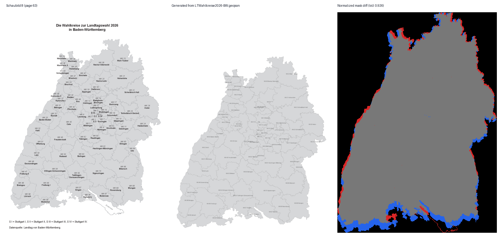

# Landtagswahl Baden-Wuerttemberg 2026 - Tracking Template

Last poll: **2026-03-01 11:40:00 CET**

## Tracking Window

- Tracking starts at **2026-03-08 18:00 CET**. Before this point, official result collection is intentionally disabled.

## Data Sources

- `komm.one` municipality APIs (template: `https://wahlergebnisse.komm.one/lb/produktion/wahltermin-{wahltermin}/{ags}` + `/daten/api/...`)
- Statistik BW single CSV (current mode: **DUMMY**) at `/Users/raphaelvolz/Github/lw26-bw-wahlergebnis/data/ltw26/metadata/2026021_LTW26-Dummy-Datei.csv`

## Operations

- Local run: `python scripts/poll_ltw26.py`
- SQLite history DB: `data/ltw26/history.sqlite`
- Minute automation: `.github/workflows/poll.yml`

## Coverage

- Municipalities tracked: **1104**
- `komm.one` complete: **0**
- `komm.one` pending: **0**
- `komm.one` no data: **1104**

## Wahlkreis Map

- Wahlkreise complete: **0**
- Wahlkreise pending: **70**
- Wahlkreise no data: **0**
- Status table: `data/ltw26/metadata/wahlkreis-status.csv`
- Geometry source ZIP: `https://www.statistik-bw.de/fileadmin/user_upload/medien/bilder/Karten_und_Geometrien_der_Wahlkreise/LTWahlkreise2026-BW_GEOJSON.zip`
- SHP source ZIP: `https://www.statistik-bw.de/fileadmin/user_upload/medien/bilder/Karten_und_Geometrien_der_Wahlkreise/LTWahlkreise2026-BW_SHP.zip`

## Map QA (Schaubild 8)

- Last run (UTC): **2026-03-01T10:39:51.744412+00:00**
- IoU vs Schaubild 8 page 63: **0.926** (threshold **0.900**)
- Passed: **True**
- Validation command: `python scripts/test_map_against_schaubild8.py`

## Party Dashboard (Municipality Drill-Down)

No party data available yet.

## Pending Results

Showing 200 of 1104 rows. Full export: `data/ltw26/latest/kommone_snapshots.csv`.

Open pending municipalities

| AGS | Municipality | `komm.one` reported/total | Status |
|---|---|---:|---|
| 08335001 | Aach-Stadt |  | no_data |
| 08136088 | Aalen-Stadt |  | no_data |
| 08125001 | Abstatt |  | no_data |
| 08136002 | Abtsgmünd |  | no_data |
| 08436001 | Achberg |  | no_data |
| 08317001 | Achern-Stadt |  | no_data |
| 08426001 | Achstetten |  | no_data |
| 08117001 | Adelberg |  | no_data |
| 08136003 | Adelmannsfelden |  | no_data |
| 08225001 | Adelsheim-Stadt |  | no_data |
| 08118001 | Affalterbach |  | no_data |
| 08225002 | Aglasterhausen |  | no_data |
| 08128138 | Ahorn |  | no_data |
| 08117002 | Aichelberg |  | no_data |
| 08325001 | Aichhalden |  | no_data |
| 08436003 | Aichstetten |  | no_data |
| 08116081 | Aichtal-Stadt |  | no_data |
| 08116076 | Aichwald |  | no_data |
| 08115001 | Aidlingen |  | no_data |
| 08336004 | Aitern |  | no_data |
| 08436004 | Aitrach |  | no_data |
| 08337002 | Albbruck |  | no_data |
| 08117003 | Albershausen |  | no_data |
| 08417079 | Albstadt-Stadt |  | no_data |
| 08327002 | Aldingen |  | no_data |
| 08119001 | Alfdorf |  | no_data |
| 08335002 | Allensbach |  | no_data |
| 08426005 | Alleshausen |  | no_data |
| 08426006 | Allmannsweiler |  | no_data |
| 08425002 | Allmendingen |  | no_data |
| 08119003 | Allmersbach im Tal |  | no_data |
| 08237002 | Alpirsbach-Stadt |  | no_data |
| 08116004 | Altbach |  | no_data |
| 08115002 | Altdorf |  | no_data |
| 08116005 | Altdorf |  | no_data |
| 08116006 | Altenriet |  | no_data |
| 08235006 | Altensteig-Stadt |  | no_data |
| 08425004 | Altheim |  | no_data |
| 08426008 | Altheim |  | no_data |
| 08425005 | Altheim (Alb) |  | no_data |
| 08235007 | Althengstett |  | no_data |
| 08119004 | Althütte |  | no_data |
| 08226003 | Altlußheim |  | no_data |
| 08436005 | Altshausen |  | no_data |
| 08416048 | Ammerbuch |  | no_data |
| 08425008 | Amstetten |  | no_data |
| 08436006 | Amtzell |  | no_data |
| 08226102 | Angelbachtal |  | no_data |
| 08317005 | Appenweier |  | no_data |
| 08436094 | Argenbühl |  | no_data |
| 08119087 | Aspach |  | no_data |
| 08118003 | Asperg-Stadt |  | no_data |
| 08128006 | Assamstadt |  | no_data |
| 08425011 | Asselfingen |  | no_data |
| 08426011 | Attenweiler |  | no_data |
| 08315003 | Au |  | no_data |
| 08119006 | Auenwald |  | no_data |
| 08315004 | Auggen |  | no_data |
| 08436008 | Aulendorf-Stadt |  | no_data |
| 08119008 | Backnang-Stadt |  | no_data |
| 08336006 | Bad Bellingen |  | no_data |
| 08117012 | Bad Boll |  | no_data |
| 08426013 | Bad Buchau-Stadt |  | no_data |
| 08117006 | Bad Ditzenbach |  | no_data |
| 08326003 | Bad Dürrheim-Stadt |  | no_data |
| 08125005 | Bad Friedrichshall-Stadt |  | no_data |
| 08235033 | Bad Herrenalb-Stadt |  | no_data |
| 08315006 | Bad Krozingen-Stadt |  | no_data |
| 08235008 | Bad Liebenzell-Stadt |  | no_data |
| 08128007 | Bad Mergentheim-Stadt |  | no_data |
| 08317008 | Bad Peterstal-Griesbach |  | no_data |
| 08125006 | Bad Rappenau-Stadt |  | no_data |
| 08237075 | Bad Rippoldsau-Schapbach |  | no_data |
| 08437100 | Bad Saulgau-Stadt |  | no_data |
| 08426014 | Bad Schussenried-Stadt |  | no_data |
| 08215100 | Bad Schönborn |  | no_data |
| 08337096 | Bad Säckingen-Stadt |  | no_data |
| 08235084 | Bad Teinach-Zavelstein-Stadt |  | no_data |
| 08415078 | Bad Urach-Stadt |  | no_data |
| 08436009 | Bad Waldsee-Stadt |  | no_data |
| 08235079 | Bad Wildbad-Stadt |  | no_data |
| 08125007 | Bad Wimpfen-Stadt |  | no_data |
| 08436010 | Bad Wurzach-Stadt |  | no_data |
| 08117007 | Bad Überkingen |  | no_data |
| 08211000 | Baden-Baden-Stadt |  | no_data |
| 08315007 | Badenweiler |  | no_data |
| 08316002 | Bahlingen am Kaiserstuhl |  | no_data |
| 08436011 | Baienfurt |  | no_data |
| 08237004 | Baiersbronn |  | no_data |
| 08436012 | Baindt |  | no_data |
| 08327005 | Balgheim |  | no_data |
| 08417002 | Balingen-Stadt |  | no_data |
| 08425013 | Ballendorf |  | no_data |
| 08315008 | Ballrechten-Dottingen |  | no_data |
| 08116007 | Baltmannsweiler |  | no_data |
| 08425140 | Balzheim |  | no_data |
| 08226006 | Bammental |  | no_data |
| 08136007 | Bartholomä |  | no_data |
| 08125008 | Beilstein-Stadt |  | no_data |
| 08425014 | Beimerstetten |  | no_data |
| 08116008 | Bempflingen |  | no_data |
| 08118006 | Benningen am Neckar |  | no_data |
| 08436013 | Berg |  | no_data |
| 08436014 | Bergatreute |  | no_data |
| 08317009 | Berghaupten |  | no_data |
| 08425017 | Berghülen |  | no_data |
| 08119089 | Berglen |  | no_data |
| 08426019 | Berkheim |  | no_data |
| 08435005 | Bermatingen |  | no_data |
| 08337013 | Bernau im Schwarzwald |  | no_data |
| 08425019 | Bernstadt |  | no_data |
| 08118007 | Besigheim-Stadt |  | no_data |
| 08426020 | Betzenweiler |  | no_data |
| 08116011 | Beuren |  | no_data |
| 08437005 | Beuron |  | no_data |
| 08317011 | Biberach |  | no_data |
| 08426021 | Biberach an der Riß-Stadt |  | no_data |
| 08316003 | Biederbach |  | no_data |
| 08118079 | Bietigheim-Bissingen-Stadt |  | no_data |
| 08225009 | Billigheim |  | no_data |
| 08225010 | Binau |  | no_data |
| 08437008 | Bingen |  | no_data |
| 08336008 | Binzen |  | no_data |
| 08117009 | Birenbach |  | no_data |
| 08236004 | Birkenfeld |  | no_data |
| 08417008 | Bisingen |  | no_data |
| 08116012 | Bissingen an der Teck |  | no_data |
| 08417010 | Bitz |  | no_data |
| 08425020 | Blaubeuren-Stadt |  | no_data |
| 08127008 | Blaufelden |  | no_data |
| 08425141 | Blaustein-Stadt |  | no_data |
| 08326005 | Blumberg-Stadt |  | no_data |
| 08416006 | Bodelshausen |  | no_data |
| 08335098 | Bodman-Ludwigshafen |  | no_data |
| 08436018 | Bodnegg |  | no_data |
| 08315014 | Bollschweil |  | no_data |
| 08436019 | Boms |  | no_data |
| 08115004 | Bondorf |  | no_data |
| 08337022 | Bonndorf im Schwarzwald-Stadt |  | no_data |
| 08136010 | Bopfingen-Stadt |  | no_data |
| 08128014 | Boxberg-Stadt |  | no_data |
| 08125013 | Brackenheim-Stadt |  | no_data |
| 08127009 | Braunsbach |  | no_data |
| 08315015 | Breisach am Rhein-Stadt |  | no_data |
| 08425024 | Breitingen |  | no_data |
| 08315016 | Breitnau |  | no_data |
| 08215007 | Bretten-Stadt |  | no_data |
| 08126011 | Bretzfeld |  | no_data |
| 08336991 | Briefwahl für mehrere Gemeinden |  | no_data |
| 08425991 | Briefwahl für mehrere Gemeinden |  | no_data |
| 08436991 | Briefwahl für mehrere Gemeinden |  | no_data |
| 08326075 | Brigachtal |  | no_data |
| 08215009 | Bruchsal-Stadt |  | no_data |
| 08326006 | Bräunlingen-Stadt |  | no_data |
| 08226009 | Brühl |  | no_data |
| 08327007 | Bubsheim |  | no_data |
| 08225014 | Buchen (Odenwald)-Stadt |  | no_data |
| 08315020 | Buchenbach |  | no_data |
| 08327008 | Buchheim |  | no_data |
| 08315022 | Buggingen |  | no_data |
| 08426028 | Burgrieden |  | no_data |
| 08119018 | Burgstetten |  | no_data |
| 08417013 | Burladingen-Stadt |  | no_data |
| 08327004 | Bärenthal |  | no_data |
| 08136009 | Böbingen an der Rems |  | no_data |
| 08115003 | Böblingen-Stadt |  | no_data |
| 08117010 | Böhmenkirch |  | no_data |
| 08336010 | Böllen |  | no_data |
| 08118010 | Bönnigheim-Stadt |  | no_data |
| 08425022 | Börslingen |  | no_data |
| 08117011 | Börtlingen |  | no_data |
| 08325009 | Bösingen |  | no_data |
| 08327006 | Böttingen |  | no_data |
| 08315013 | Bötzingen |  | no_data |
| 08127012 | Bühlertann |  | no_data |
| 08127013 | Bühlerzell |  | no_data |
| 08335015 | Büsingen am Hochrhein |  | no_data |
| 08235085 | Calw-Stadt |  | no_data |
| 08125017 | Cleebronn |  | no_data |
| 08127014 | Crailsheim-Stadt |  | no_data |
| 08128020 | Creglingen-Stadt |  | no_data |
| 08337027 | Dachsberg (Südschwarzwald) |  | no_data |
| 08435010 | Daisendorf |  | no_data |
| 08326010 | Dauchingen |  | no_data |
| 08417014 | Dautmergen |  | no_data |
| 08115010 | Deckenpfronn |  | no_data |
| 08435067 | Deggenhausertal |  | no_data |
| 08117014 | Deggingen |  | no_data |
| 08327009 | Deilingen |  | no_data |
| 08116014 | Deizisau |  | no_data |
| 08325072 | Deißlingen |  | no_data |
| 08116015 | Denkendorf |  | no_data |
| 08327010 | Denkingen |  | no_data |
| 08316009 | Denzlingen |  | no_data |
| 08416009 | Dettenhausen |  | no_data |
| 08215111 | Dettenheim |  | no_data |
| 08337030 | Dettighofen |  | no_data |
| 08415014 | Dettingen an der Erms |  | no_data |
| 08426031 | Dettingen an der Iller |  | no_data |
| 08116016 | Dettingen unter Teck |  | no_data |

## Source Difference Summary

| Metric | Rows with Delta | Sum(|delta|) |
|---|---:|---:|
| reported_precincts | 0 | 0.00 |
| total_precincts | 0 | 0.00 |
| voters_total | 0 | 0.00 |
| valid_votes | 0 | 0.00 |

## Notes

- Polling is designed for minute-level snapshots and immutable timing of updates/removals.
- No official results are expected before **2026-03-08 18:00 CET**.
- `komm.one` is expected to publish first. Statistik BW may start later; fallback currently uses the provided dummy CSV.
- If Statistik BW keeps coded party columns (e.g. `D1`, `F1`), cross-source party mapping requires an external codebook.
