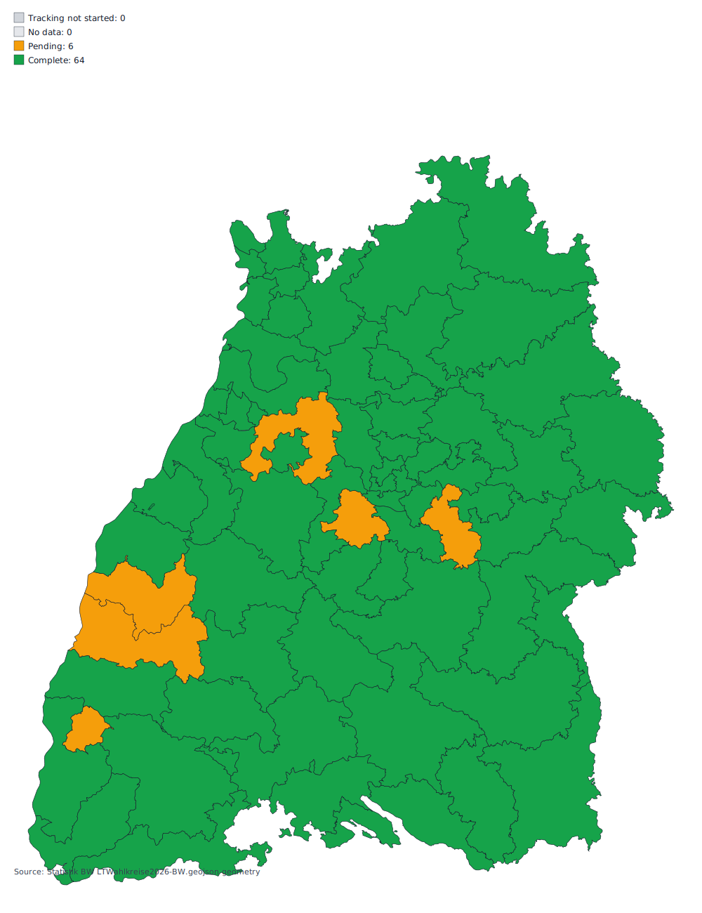

# Landtagswahl Baden-Württemberg 2026 (2026-bw) - Tracking Template

Last poll: **2026-03-08 16:13:29 CET**

## Tracking Window

- Tracking starts at **2026-03-08 18:00 CET**. Before this point, official result collection is intentionally disabled.

## Data Sources

- `komm.one` municipality result pages (current 2026 HTML structure, discovered recursively per county/wahlkreis)
- Statistik BW single CSV (current mode: **DUMMY**) at `/Users/raphaelvolz/Github/ltw26-bw-wahlergebnis/data/2026-bw/metadata/2026021_LTW26-Dummy-Datei.csv`

## Operations

- Local run: `python scripts/poll_election.py --election-key 2026-bw`
- Local minute loop: `python scripts/run_local_poll_loop.py --election-key 2026-bw --start-at 18:00`
- Local mock run (Statistik BW dummy CSV only): `python scripts/run_local_mock_poll.py --election-key 2026-bw --iterations 1 --limit-ags 10`
- Validate dummy StatLA result: `python scripts/validate_dummy_statla_result.py --election-key 2026-bw`
- Generate static drill-down pages: `python scripts/generate_static_detail_pages.py --election-key 2026-bw`
- Site index for this election: `site/2026-bw/index.html`
- SQLite history DB (local cache, not committed): `data/2026-bw/history.sqlite`
- Rebuild SQLite from git deltas: `python scripts/rebuild_history_sqlite_from_git_deltas.py --election-key 2026-bw`
- GitHub Pages deploy workflow (manual): `.github/workflows/pages.yml`

## Coverage

- Municipalities tracked: **1**
- `komm.one` complete: **0**
- `komm.one` pending: **0**
- `komm.one` no data: **1**

## Wahlkreis Map

- Wahlkreise complete: **0**
- Wahlkreise pending: **70**
- Wahlkreise no data: **0**
- Status table: `data/2026-bw/metadata/wahlkreis-status.csv`
- Geometry source ZIP: `https://www.statistik-bw.de/fileadmin/user_upload/medien/bilder/Karten_und_Geometrien_der_Wahlkreise/LTWahlkreise2026-BW_GEOJSON.zip`
- SHP source ZIP: `https://www.statistik-bw.de/fileadmin/user_upload/medien/bilder/Karten_und_Geometrien_der_Wahlkreise/LTWahlkreise2026-BW_SHP.zip`

## Party Totals (First and Second Votes)

### Erststimmen

| Party | `komm.one` Count | `komm.one` Share | `statla` Count | `statla` Share | Delta Count (`komm.one`-`statla`) | Delta Share (`komm.one`-`statla`) |
|---|---:|---:|---:|---:|---:|---:|
| GRÜNE | 0 | 0.00% | 0 | 0.00% | +0 | +0.00% |
| CDU | 0 | 0.00% | 0 | 0.00% | +0 | +0.00% |
| SPD | 0 | 0.00% | 0 | 0.00% | +0 | +0.00% |
| FDP | 0 | 0.00% | 0 | 0.00% | +0 | +0.00% |
| AfD | 0 | 0.00% | 0 | 0.00% | +0 | +0.00% |
| Die Linke | 0 | 0.00% | 0 | 0.00% | +0 | +0.00% |
| FREIE WÄHLER | 0 | 0.00% | 0 | 0.00% | +0 | +0.00% |
| Die PARTEI | 0 | 0.00% | 0 | 0.00% | +0 | +0.00% |
| dieBasis | 0 | 0.00% | 0 | 0.00% | +0 | +0.00% |
| ÖDP | 0 | 0.00% | 0 | 0.00% | +0 | +0.00% |
| Volt | 0 | 0.00% | 0 | 0.00% | +0 | +0.00% |
| Bündnis C | 0 | 0.00% | 0 | 0.00% | +0 | +0.00% |
| BSW | 0 | 0.00% | 0 | 0.00% | +0 | +0.00% |
| Die Gerechtigkeitspartei | 0 | 0.00% | 0 | 0.00% | +0 | +0.00% |
| Tierschutzpartei | 0 | 0.00% | 0 | 0.00% | +0 | +0.00% |
| Werteunion | 0 | 0.00% | 0 | 0.00% | +0 | +0.00% |
| Anderer Kreiswahlvorschlag | 0 | 0.00% | 0 | 0.00% | +0 | +0.00% |
| **TOTAL** | 0 | 0.00% | 0 | 0.00% | +0 | +0.00% |

### Zweitstimmen

| Party | `komm.one` Count | `komm.one` Share | `statla` Count | `statla` Share | Delta Count (`komm.one`-`statla`) | Delta Share (`komm.one`-`statla`) |
|---|---:|---:|---:|---:|---:|---:|
| GRÜNE | 0 | 0.00% | 0 | 0.00% | +0 | +0.00% |
| CDU | 0 | 0.00% | 0 | 0.00% | +0 | +0.00% |
| SPD | 0 | 0.00% | 0 | 0.00% | +0 | +0.00% |
| FDP | 0 | 0.00% | 0 | 0.00% | +0 | +0.00% |
| AfD | 0 | 0.00% | 0 | 0.00% | +0 | +0.00% |
| Die Linke | 0 | 0.00% | 0 | 0.00% | +0 | +0.00% |
| FREIE WÄHLER | 0 | 0.00% | 0 | 0.00% | +0 | +0.00% |
| Die PARTEI | 0 | 0.00% | 0 | 0.00% | +0 | +0.00% |
| dieBasis | 0 | 0.00% | 0 | 0.00% | +0 | +0.00% |
| KlimalisteBW | 0 | 0.00% | 0 | 0.00% | +0 | +0.00% |
| ÖDP | 0 | 0.00% | 0 | 0.00% | +0 | +0.00% |
| Volt | 0 | 0.00% | 0 | 0.00% | +0 | +0.00% |
| Bündnis C | 0 | 0.00% | 0 | 0.00% | +0 | +0.00% |
| PDH | 0 | 0.00% | 0 | 0.00% | +0 | +0.00% |
| Verjüngungsforschung | 0 | 0.00% | 0 | 0.00% | +0 | +0.00% |
| BSW | 0 | 0.00% | 0 | 0.00% | +0 | +0.00% |
| Die Gerechtigkeitspartei | 0 | 0.00% | 0 | 0.00% | +0 | +0.00% |
| PDR | 0 | 0.00% | 0 | 0.00% | +0 | +0.00% |
| PdF | 0 | 0.00% | 0 | 0.00% | +0 | +0.00% |
| Tierschutzpartei | 0 | 0.00% | 0 | 0.00% | +0 | +0.00% |
| Werteunion | 0 | 0.00% | 0 | 0.00% | +0 | +0.00% |
| **TOTAL** | 0 | 0.00% | 0 | 0.00% | +0 | +0.00% |

## Party Dashboard (Municipality Drill-Down)

No party data available yet.

## Pending Results

Showing 1 of 1 rows. Full export: `data/2026-bw/latest/kommone_snapshots.csv`.

Open pending municipalities

| AGS | Municipality | `komm.one` reported/total | Status |
|---|---|---:|---|
| 08111000 | Stuttgart-Landeshauptstadt |  | no_data |

## Source Difference Summary

| Metric | Rows with Delta | Sum(|delta|) |
|---|---:|---:|
| reported_precincts | 0 | 0.00 |
| total_precincts | 0 | 0.00 |
| voters_total | 0 | 0.00 |
| valid_votes | 0 | 0.00 |

## Notes

- Polling is designed for minute-level snapshots and immutable timing of updates/removals.
- No official results are expected before **2026-03-08 18:00 CET**.
- Statistik BW live data is now published from `wahlen.statistik-bw.de`; fallback still uses the provided dummy CSV when needed.
- `komm.one` is polled from the current public HTML result pages because the legacy `/daten/api/...` path is no longer available on the 2026 site.
- Statistik BW coded party columns (`D*`, `F*`) are resolved using the official Hinweise party codebook.
- Election storage is keyed by `2026-bw` under `data/2026-bw/` and `site/2026-bw/`.
