# Berlin 2026 · Probelauf mit aktuellem Datenstand

4.071 von 4.114 Wahlbezirken sind erfasst; 1.804.830 gültige Zweitstimmen liegen vor. Die Linke liegt mit 25.72 % der erfassten Zweitstimmen vorn.

Die demografische Analyse verknüpft 12 Bezirke mit dem Zensus 2022. Urnen- und Briefstimmen sind in diesen Gebieten gemeinsam enthalten.

Unter den vollständig abgedeckten Merkmalen zeigt GRÜNE mit „Abitur/Fachhochschulreife“ den größten absoluten gewichteten Zusammenhang (r = 0.94). Dies ist eine explorative Auswahl, keine kausale Erklärung.

Die amtliche Sitzverteilung liegt diesem Probelauf noch nicht bei. Der Repräsentations-Waterfall ist deshalb ausdrücklich ein Szenario, kein Nachweis tatsächlich zugeteilter Sitze.

Die Auszählung ist offen. Fehlende Meldungen sind geografisch selektiv; alle Ergebnisse und Korrelationen dieses Probelaufs können sich ändern. Das CSV enthält zusätzlich eine Auswertung nur vollständig gemeldeter Gebiete.

Zensuswerte beschreiben alle Einwohner bzw. die angegebenen Haushalts-/Personengruppen von 2022, nicht die Wahlberechtigten von 2026. Gebietsmerkmale lassen keine individuellen Wahlentscheidungen erkennen.

Altersbänder sind hier 67+ und 19–24 Jahre (veröffentlichte Zensusklassen); sie entsprechen nicht den LSA-Bändern 65+ und 18–29 aus 2025. Dichte und Bevölkerungsänderung 2024–25 werden ohne passende Datengrundlage nicht berechnet.

Unterdrückte oder fehlende Zensuswerte werden nicht durch null ersetzt. Paarweise Stichprobengrößen und Stimmenabdeckung werden für jedes Merkmal ausgewiesen.

Pearson und Spearman werden gleichgewichtet und stimmengewichtet ausgegeben; die binäre Stimmkorrelation bezeichnet das Wohngebiet als Kontext. Es werden keine p-Werte, Betrugssignale oder Individualeffekte behauptet.

Vollständige Auszählung bedeutet einen vollständig erfassten (gegebenenfalls vorläufigen) Stand, nicht ein amtlich festgestelltes Endergebnis.

Die aktuelle normalisierte Quelle enthält Wahlkreise und Bezirke, aber keine einzelnen Wahlbezirke. Wahlbezirksstreuung bleibt deshalb aus. Bei zwölf Bezirken wird das fünfvariable LSA-Zählmodell nicht geschätzt.

Brief-/Urnenvergleich: separat datierte, amtlich veröffentlichte Prozentwerte. Absolute Stimmen und gültige Stimmen je Modus werden in dieser Quelle nicht angegeben und nicht zurückgerechnet.

## Politische Repräsentation

Szenario: Parteien ab 5 % oder mit aktueller Erststimmenführung; keine amtliche Sitzfeststellung. 1.571.849 Stimmen · 87.09 % der erfassten gültigen Zweitstimmen.

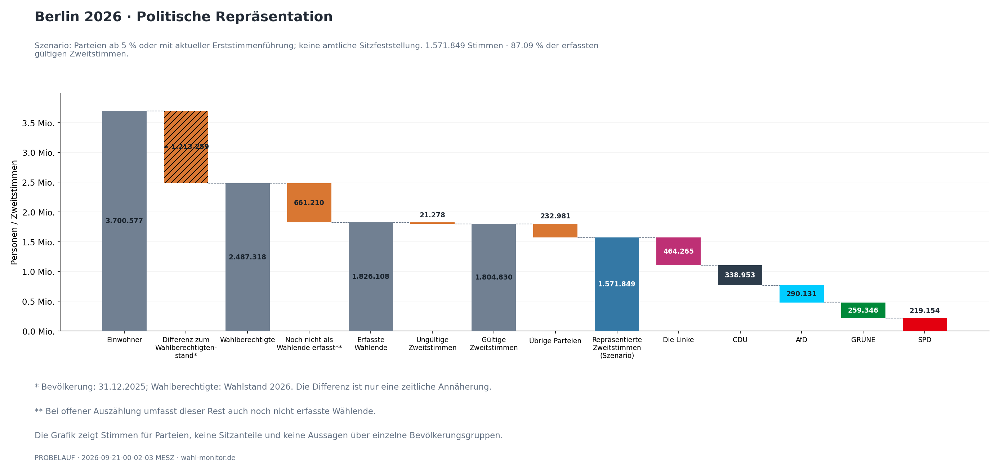

Daten: representation_waterfall.csv; representation_sources.json

## Erst- und Zweitstimmen

Unterschiedliche Stimmarten haben eigene Nenner.

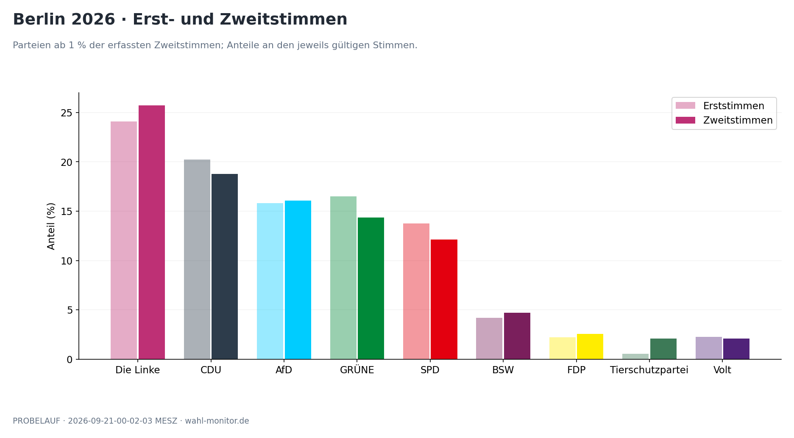

Daten: party_results.csv

## Streuung · Wahlkreise

Deskriptive Gebietsverteilung, keine Unsicherheitsintervalle.

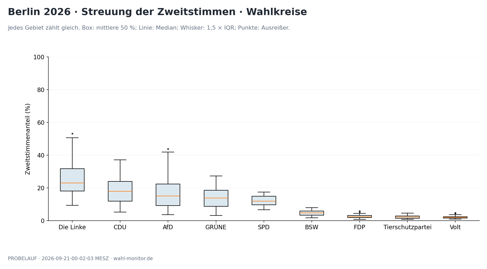

Daten: results_by_area.csv

## Briefwahl und Urnenwahl

Amtlich publizierte Prozentwerte je Modus · 20.09.2026, 23:59:22 MESZ · Parteien über 5 % in mindestens einem Modus. Absolute Stimmen/Nenner fehlen.

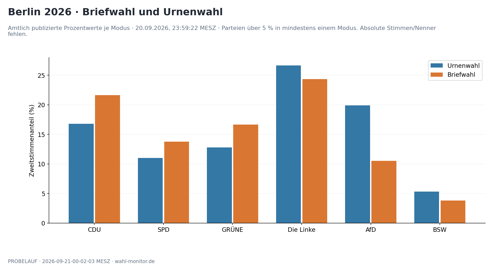

Daten: voting_modes.csv; sources/official_voting_modes.html

## Stärkste Partei nach Zweitstimmen

Kartierung der aktuellen Wahlkreisergebnisse; keine Sitzmehrheiten.

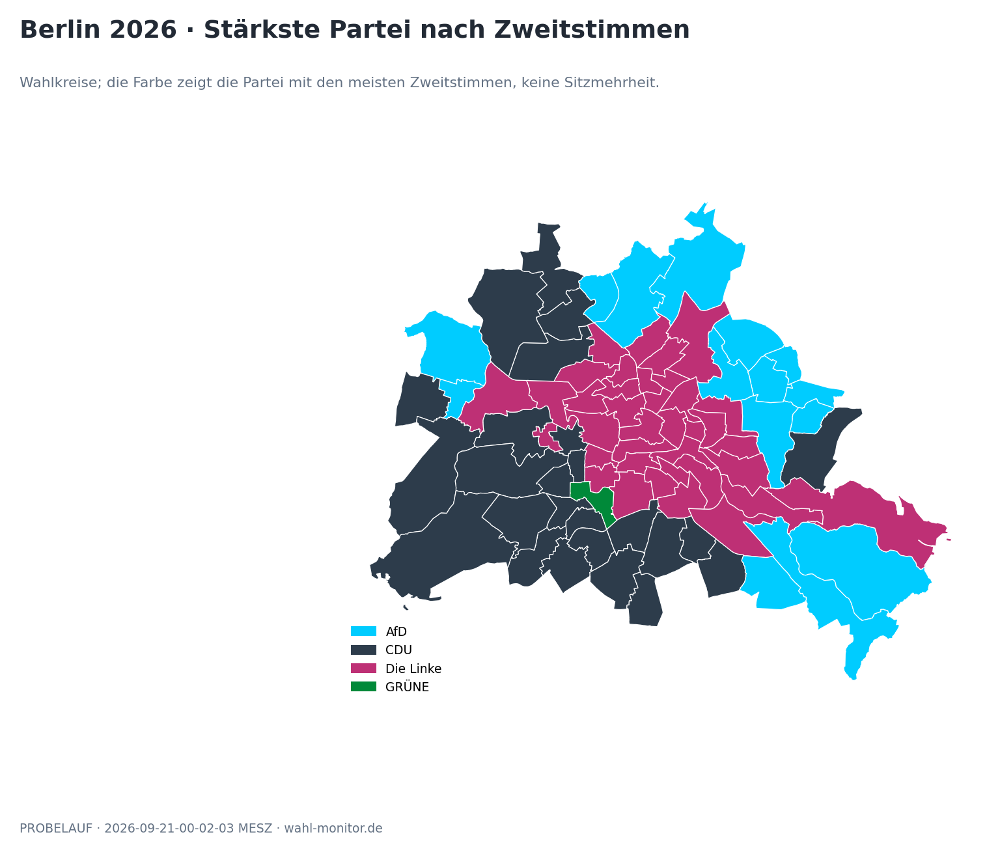

Daten: 05_staerkste_partei.csv; sources/wahlkreise.geojson

## AfD: absolute Mehrheit der Zweitstimmen

Kartierung der aktuellen Wahlkreisergebnisse; keine Sitzmehrheiten.

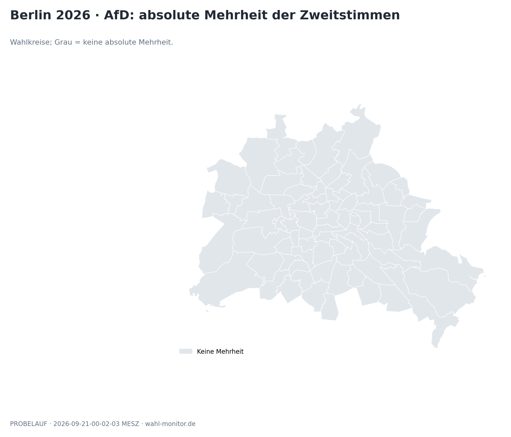

Daten: 06_afd_mehrheit.csv; sources/wahlkreise.geojson

## Linke, SPD und GRÜNE: gemeinsame Zweitstimmenmehrheit

Kartierung der aktuellen Wahlkreisergebnisse; keine Sitzmehrheiten.

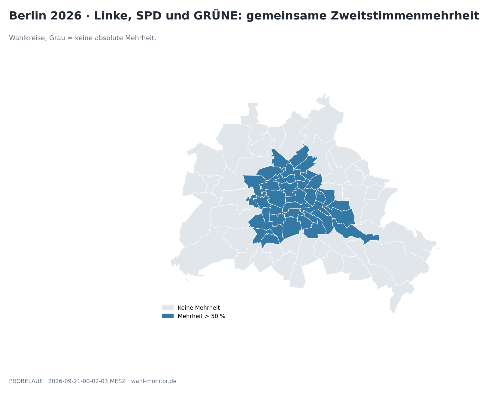

Daten: 07_linke_spd_gruene.csv; sources/wahlkreise.geojson

## Verlauf der Auszählung

Der Nenner stammt aus jedem einzelnen Abruf.

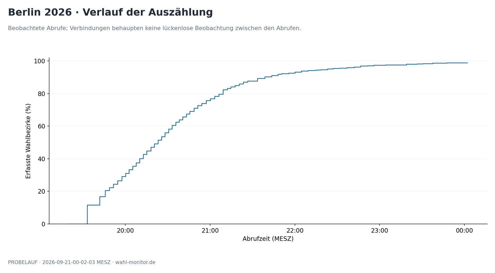

Daten: counting_timeline.csv

## Parteianteile im Verlauf

Frühe Ergebnisse sind geografisch selektiv.

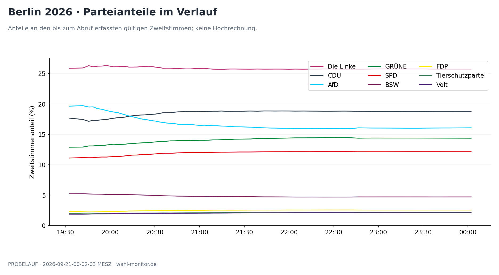

Daten: party_timeline.csv

## AfD-Anteil beim ersten positiven Ergebnis

MV-Meldegebiete enthalten gesonderte Briefwahlgebiete; hier keine demografischen Einheiten.

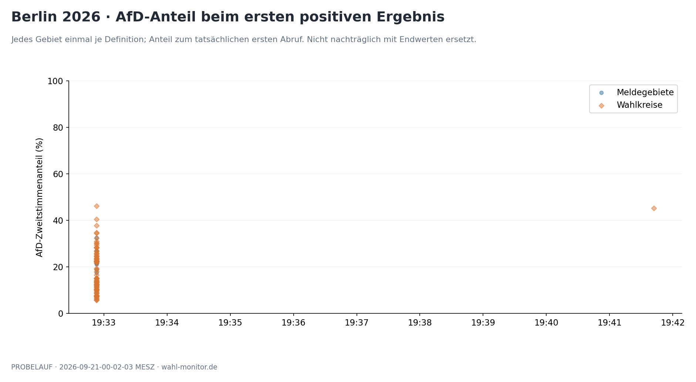

Daten: arrival_observations.csv

## AfD-Anteil bei erster Vollmeldung

MV-Meldegebiete enthalten gesonderte Briefwahlgebiete; hier keine demografischen Einheiten.

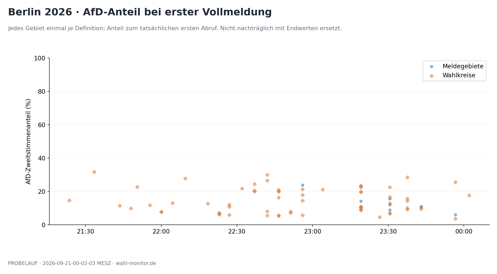

Daten: arrival_observations.csv

## Demografische Zusammenhänge

Vollständiges Merkmalsraster; unterschiedliche Abdeckung steht im Coverage-CSV.

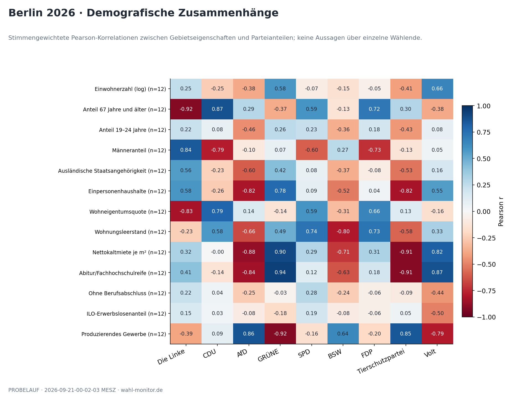

Daten: demographic_correlations.csv; demographic_coverage.csv

## Was verändert die Stimmengewichtung?

Gewichte ändern die Fragestellung; sie liefern keine Individualdaten.

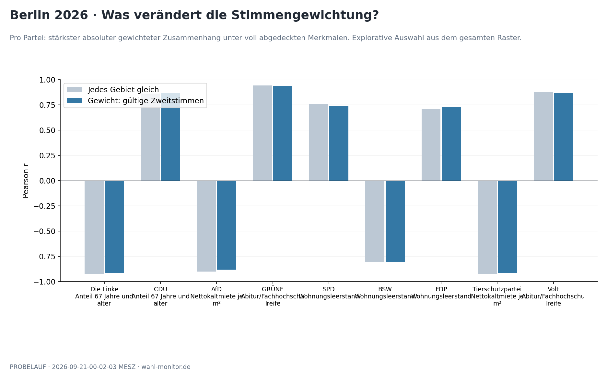

Daten: demographic_strongest.csv

## Geografische Sensitivität

Punkt: alle Gebiete; Linie: Spannweite nach geografischem Ausschluss.

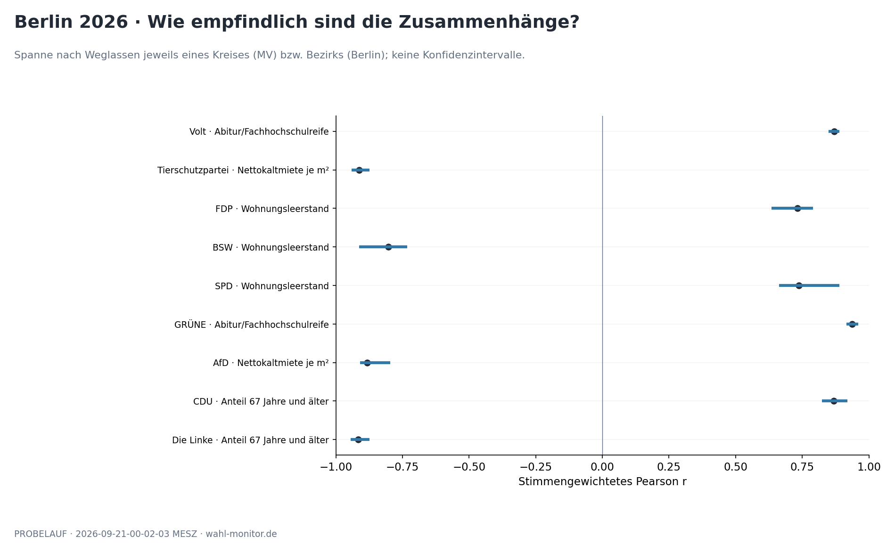

Daten: demographic_leave_one_block_out.csv

## GRÜNE und Abitur/Fachhochschulreife

Jeder Punkt ist ein Gebiet, keine Person.

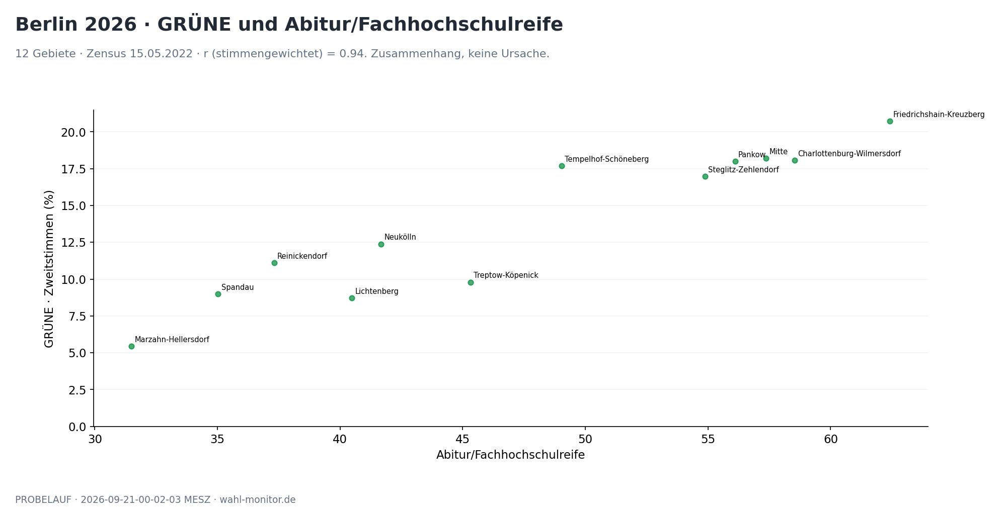

Daten: demographic_areas.csv

## Die Linke und Anteil 67 Jahre und älter

Jeder Punkt ist ein Gebiet, keine Person.

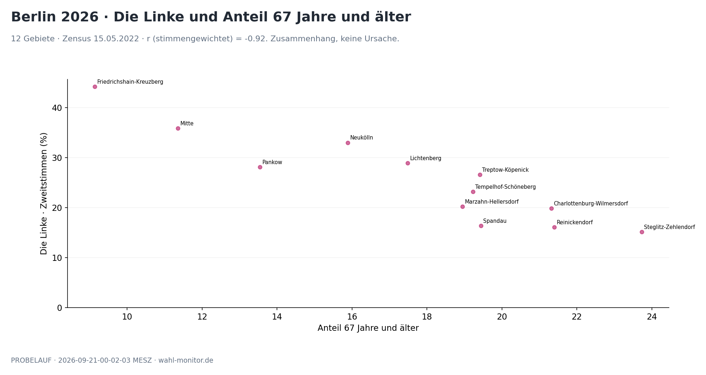

Daten: demographic_areas.csv

