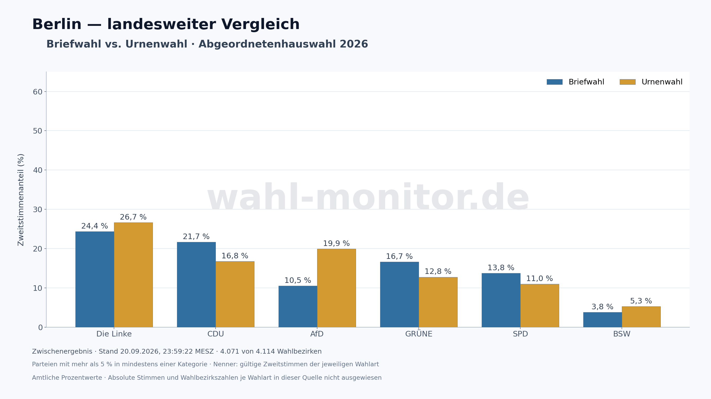

# Berlin: Briefwahl und Urnenwahl 2026

Die größten Unterschiede unter den dargestellten Parteien: **CDU liegt bei der Briefwahl um 4,87 Prozentpunkte höher**, **AfD um 9,38 Prozentpunkte niedriger** als bei der Urnenwahl.

**Zwischenergebnis, Stand 20.09.2026, 23:59:22 MESZ: 4.071 von 4.114 Wahlbezirken.** Die Auszählung ist noch nicht vollständig; spätere Meldungen können die Anteile verändern.



| Partei | Briefwahl | Urnenwahl | Brief minus Urne (Prozentpunkte) |
|---|---:|---:|---:|
| Die Linke | 24,36 % | 26,67 % | -2.31 |
| CDU | 21,65 % | 16,78 % | +4.87 |
| AfD | 10,54 % | 19,92 % | -9.38 |
| GRÜNE | 16,65 % | 12,78 % | +3.87 |
| SPD | 13,77 % | 11,01 % | +2.76 |
| BSW | 3,83 % | 5,31 % | -1.49 |

[PNG](briefwahl-vs-urnenwahl.png) · [SVG](briefwahl-vs-urnenwahl.svg) · [CSV mit allen verfügbaren Kategorien](briefwahl-vs-urnenwahl.csv)

## Einordnung und Methode

Wie beim Vergleich für Wahlkreis 14 werden Parteien mit mehr als 5 % in mindestens einer Wahlart gezeigt. Jeder Anteil bezieht sich auf **alle gültigen Zweitstimmen der jeweiligen Wahlart**, einschließlich nicht gezeigter Parteien. Die Differenz ist Briefwahl minus Urnenwahl in Prozentpunkten.

Verwendet werden die präzisen Prozentwerte der amtlichen landesweiten Grafik „Vergleich Urne-/Briefwahl: Zweitstimmen“. Beide vollständigen Prozentreihen einschließlich Sonstige ergeben jeweils 100 %. Absolute Parteistimmen, gültige Zweitstimmen und Wahlbezirkszahlen je Wahlart sind in dieser Quelle nicht ausgewiesen und bleiben im CSV leer. Es werden keine Stimmenzahlen aus gerundeten Anteilen rekonstruiert. Einzelne kleine Parteien sind nur als Sonstige verfügbar; Sonstige wird als Sammelkategorie nicht wie eine Partei in die >5%-Auswahl aufgenommen. `official-chart.json` erhält beide Originalreihen.

Die Unterschiede beschreiben die bisher ausgezählten Wählergruppen. Sie belegen keinen kausalen Einfluss der Wahlart auf die Parteiwahl. Unterschiede in der Zusammensetzung und im Meldestand der Gruppen werden hier nicht statistisch bereinigt.

## Quelle und Reproduktion

[Amtliche Quelle](https://www.wahlen-berlin.de/wahlen/Be2026/AFSPRAES/agh/index.html); eingefrorene Eingabedateien und SHA-256 in `sources/acquisition.json`, Prüfungen in `manifest.json`.
Der Berliner Vergleich kann einen anderen Quellenstand als das Git-basierte Video haben; die Zeitangaben sind für jedes Artefakt separat ausgewiesen.

```sh
python3 scripts/analyze_state_voting_modes.py --election 2026-be --source-dir data/2026-be/reports/statewide-voting-modes-20260920/sources --output /tmp/2026-be-voting-modes
```

Dependencies: Python, Matplotlib, BeautifulSoup and the repository poller parser. Replay uses saved sources without fetching or polling. No deployment is performed.
