# Sachsen-Anhalt: Git-Audit bei 98,27 %

## Executive Summary

- **Eine Statusrücknahme ist beobachtet:** 1 Bezirk-Statusrückgänge; Einzelstimmen sind separat auf Verfügbarkeit zu prüfen.
- **15 Revisionen in 14 Gemeinden bei gleichem Meldestand:** 12 nach vollständiger Meldung. Korrekturen und ihre Summenfortschreibung sind keine unabhängigen Vorfälle.
- **Arithmetische Prüfung und Quellennachweis:** 0 arithmetische Fehler, 0 Unterschiede zwischen normalisiertem Export und amtlichem CSV; Publikationsversatz zwischen HTML und CSV bleibt sichtbar.

Stand: **07.09.2026 00:00:20 MESZ**, Git `034045f3d0f71c47aebf3daea47f3d33b136de5c`. Kein amtliches Endergebnis. Entwürfe wurden nicht veröffentlicht.

<!-- aken-summary:start -->
**Nachtrag vom 07.09.2026, 00:51 MESZ:** Aken (Elbe), Wahlbezirk **000010**, erscheint neu und bereits gemeldet; das Landes-Soll steigt **2.660 → 2.661**. [Zeitpunkte, Belege und Einordnung](AKEN_000010.md). Die folgenden 15 Tweets behalten ihren Stand von 00:00:20 MESZ; zwei ergänzende Tweets stehen danach.
<!-- aken-summary:end -->

## Tweet-Serie mit Bildern

Jeder nummerierte Absatz ist ein eigener Tweet (maximal 280 gewichtete Zeichen). Belege und Bildhinweise gehören zum Bericht, nicht zum Tweettext.

### Tweet 1

1/15 Landtagswahl Sachsen-Anhalt: Git-Audit von 80 archivierten Abrufen. Stand 07.09. 00:00 MESZ: 2.614/2.660 Wahlbezirke (98,27 %). Ein Zwischenstandsbericht als Basis für den 100%-Lauf.

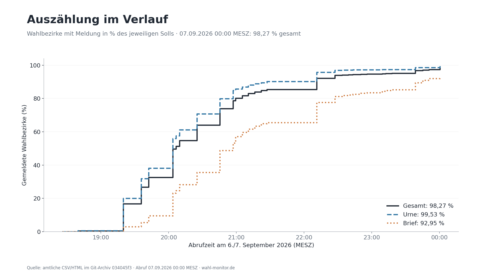

Belege: [versions.csv](versions.csv).

### Tweet 2

2/15 Zweitstimmen am Berichtsstand: AfD 44,28 %, CDU 17,02 %, SPD 9,20 %, GRÜNE 8,90 %, Die Linke 8,49 %, BSW 5,24 %. Auswahl: landesweit strikt über 5 %. Nenner: alle gültigen Zweitstimmen.

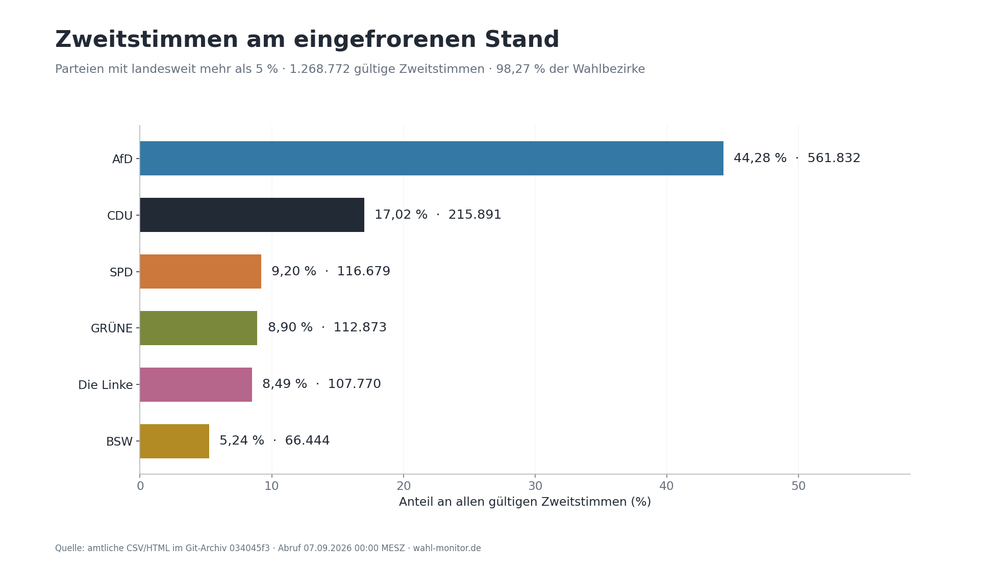

Belege: [summary.json:selected_parties](summary.json).

### Tweet 3

3/15 Parteianteile verändern sich mit den eingehenden Gebieten. Das ist eine Zeitreihe der Auszählung, keine Messung wechselnder Wählerpräferenzen. Frühe Ergebnisse sind besonders selektiv; fehlende Meldungen können den Stand noch verändern.

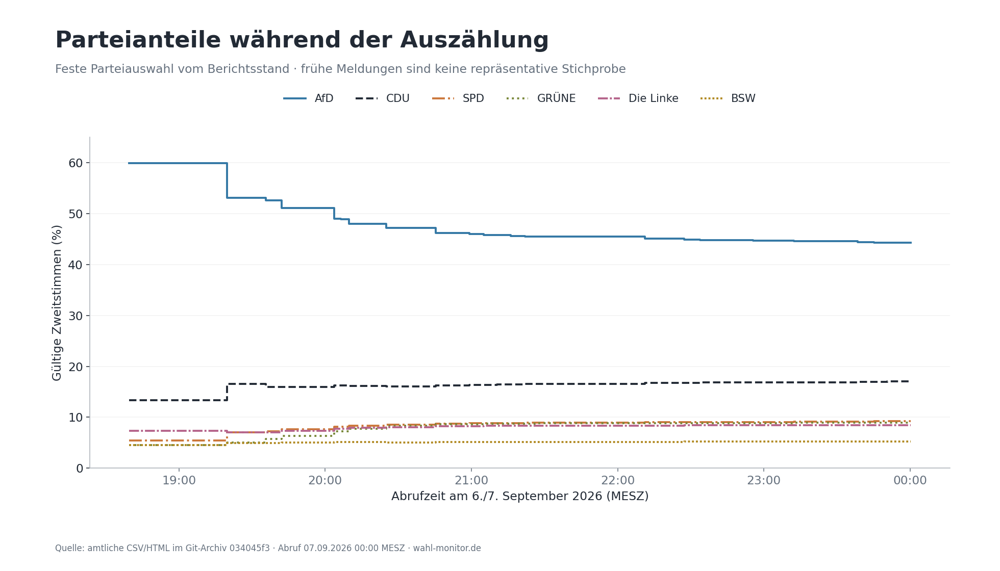

Belege: [raw_timeline.jsonl.gz](raw_timeline.jsonl.gz).

### Tweet 4

4/15 Noch offen: 10 Urnen- und 36 Briefwahlbezirke. Die erfassten Parteianteile unterscheiden sich deutlich nach Wahltyp. Später eingehende Briefwahl kann deshalb die Gesamtanteile verschieben; die Grafik ist keine Prognose.

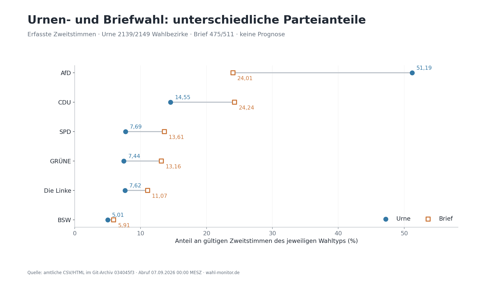

Belege: [latest_official_rows.json:lsa:LAND:15:U/B](latest_official_rows.json).

### Tweet 5

5/15 Magdeburg, Halle und Dessau-Roßlau zeigen andere Parteianteile als die übrigen Gemeinden. Die Vergleichsgruppe wird aus Stimmen summiert, nicht aus Gemeindeprozenten gemittelt. Der jeweilige Meldestand steht in der Grafik.

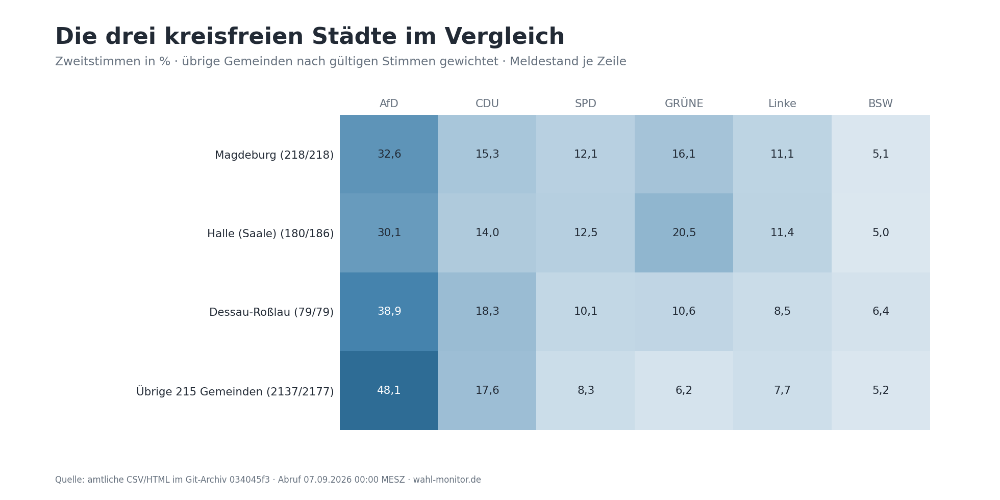

Belege: [results_by_area.csv](results_by_area.csv).

### Tweet 6

6/15 Alle 14 Kreise/kreisfreien Städte im Vergleich: Zweitstimmenanteile derselben landesweiten Parteiauswahl. Ein lokaler Anteil unter 5 % bleibt sichtbar. Verschiedene Gebietsebenen werden nicht miteinander aufsummiert.

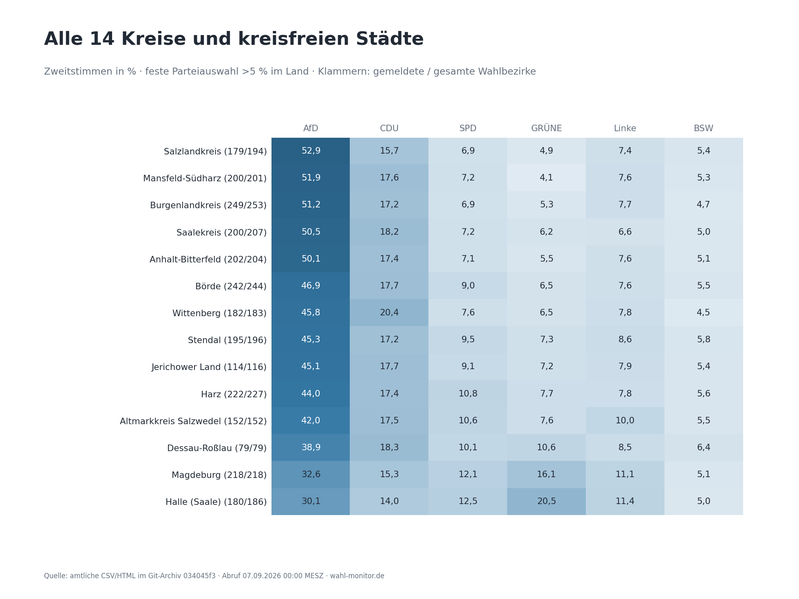

Belege: [results_by_area.csv](results_by_area.csv).

### Tweet 7

7/15 Alle 41 Wahlkreise und die Streuung in 218 Gemeinden: klare regionale Unterschiede, für sich genommen kein Unregelmäßigkeitsnachweis. Wahlkreise stammen direkt aus dem amtlichen Export; geteilte Gemeinden werden nicht pauschal zugeordnet.

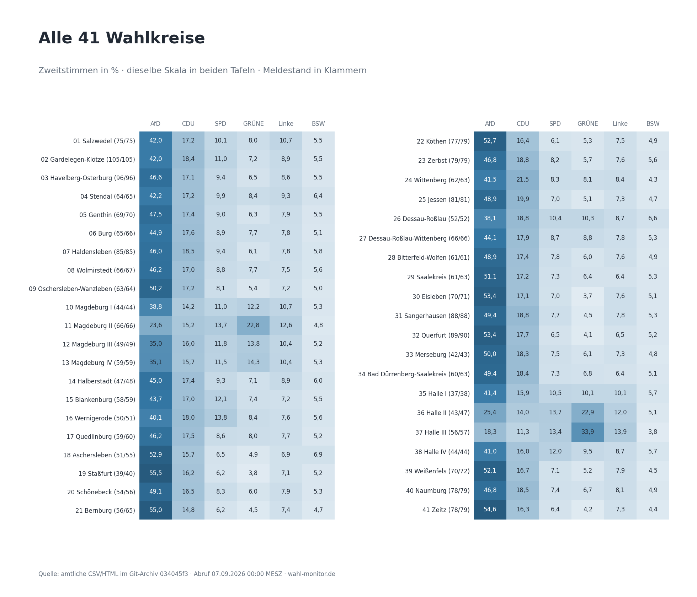

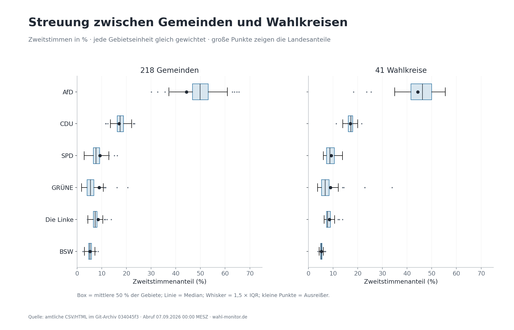

Belege: [results_by_area.csv](results_by_area.csv), [latest_areas.json](latest_areas.json).

### Tweet 8

8/15 Auffälliger Statuswechsel: Bitterfeld-Wolfen / 000028 war gemeldet, ab Abruf 19:35 nicht mehr. Ab 22:11 wieder gemeldet. Belegt ist der Meldestatus; Einzelstimmen dieses Bezirks fehlen im Archiv.

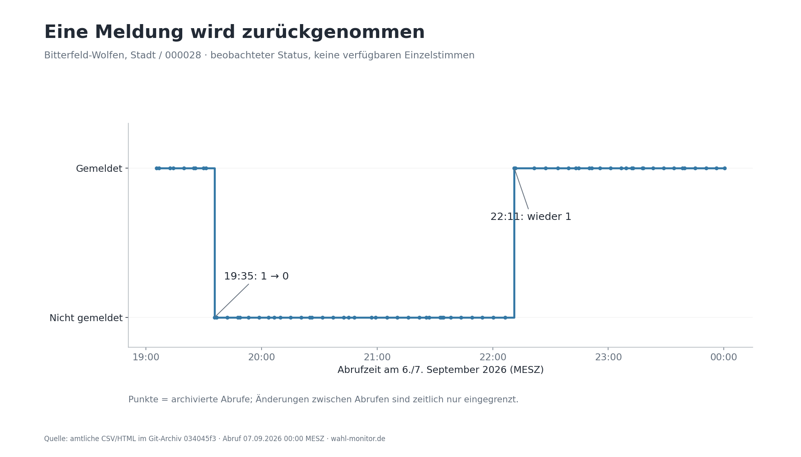

Belege: [summary.json:status_losses](summary.json), [status_timeline.jsonl.gz](status_timeline.jsonl.gz).

### Tweet 9

9/15 Bei gleichbleibender Zahl gemeldeter Wahlbezirke wurden 15 Änderungen in 14 Gemeinden beobachtet, davon 12 nach vollständiger Meldung. Dazu zählen auch Parteiverschiebungen bei unveränderter Gesamtsumme. Vollständige Vorher/Nachher-Liste im Audit.

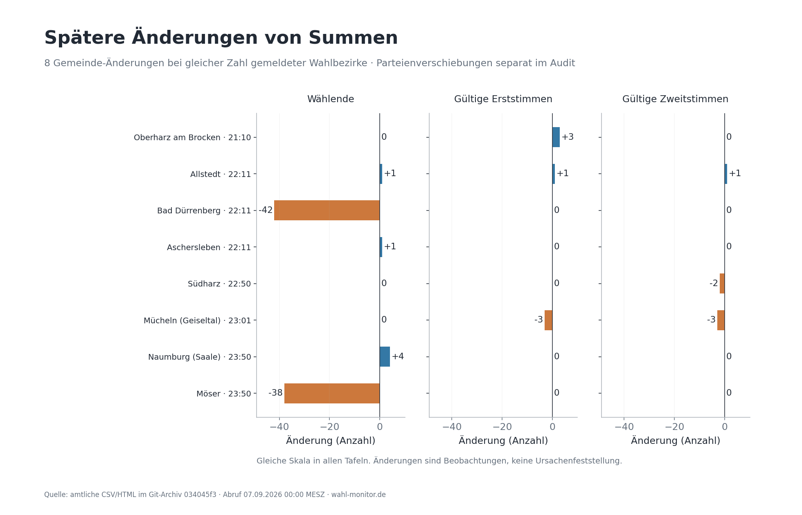

Belege: [summary.json:municipality_revisions](summary.json), [candidate_events.csv](candidate_events.csv).

### Tweet 10

10/15 Beispiel Annaburg: SPD-Erststimmen 151 → 168 (+17), FDP 85 → 68 (−17), Summe unverändert. Bad Dürrenberg: 42 Wählende weniger; gültige Stimmen unverändert, ungültige Erst- und Zweitstimmen jeweils −42. Die Ursachen sind nicht dokumentiert.

Belege: [raw_candidate_events.csv](raw_candidate_events.csv), [candidate_events.csv](candidate_events.csv).

### Tweet 11

11/15 Arithmetik: 40.880 Vergleiche von Gemeinden, Kreisen und Wahlkreisen mit ihren Summen; 669.200 Vergleiche Urne + Brief = Gesamt. Nicht-null Abweichungen: 0 bzw. 0. Wiederholte Datenstände sind mitgezählt.

Belege: [aggregation_checks.csv.gz](aggregation_checks.csv.gz), [mode_nonzero.csv](mode_nonzero.csv), [summary.json](summary.json).

### Tweet 12

12/15 Die Quellen sind nicht immer synchron: In 8 von 72 gemeinsamen Abrufen unterscheiden sich Übersicht und CSV beim Meldestand. Solche Publikationsunterschiede sind nicht mit verlorenen Stimmen gleichzusetzen.

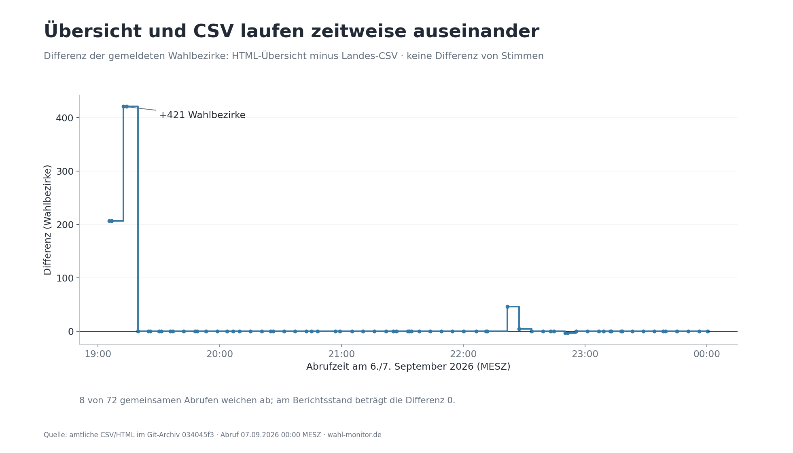

Belege: [versions.csv](versions.csv).

### Tweet 13

13/15 Am Berichtsstand fehlen 46 Wahlbezirke. Die vollständige Liste enthält Wahlkreis, Kreis, Gemeinde und Bezirksnummer. Damit lässt sich beim nächsten Lauf prüfen, welche Lücken geschlossen wurden und ob neue Statusrücknahmen hinzukamen.

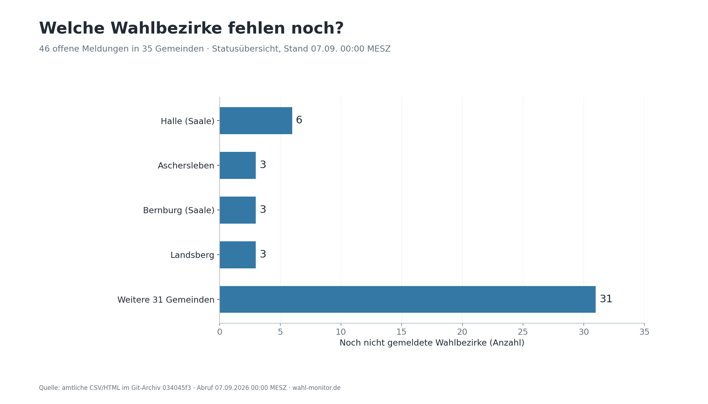

Belege: [missing_wahlbezirke.csv](missing_wahlbezirke.csv).

### Tweet 14

14/15 Prüfgrenze: Einzel-Wahlbezirksergebnisse mit Stimmen sind im Berichtsstand für 0 Bezirke vorhanden. Die Statushistorie beginnt erst um 19:05. Rücknahmen oder Korrekturen außerhalb der erfassten Zeitpunkte sind nicht ausschließbar.

Belege: [summary.json](summary.json), [versions.csv](versions.csv).

### Tweet 15

15/15 Der 100%-Lauf wird mit neuer Git-Referenz reproduziert und gegen diesen Stand verglichen. Vollständige Meldung ist nicht gleich amtliches Endergebnis. Änderungen sind belegt; ihre Ursachen und mögliche Wahlunregelmäßigkeiten brauchen zusätzliche Belege.

Belege: [METHODS.md](METHODS.md).

<!-- aken-detail:start -->
## Nachtrag: Aken 000010 und das erhöhte Soll

Am 7. September zwischen den Archivläufen 00:45:41 und 00:51:10 MESZ erscheint genau eine zusätzliche Bezirksidentität. Die beiden Tweets ergänzen den ursprünglichen Bericht; sie aktualisieren nicht dessen übrige Auswertungen.

### Nachtrag-Tweet 1

Nachtrag 1/2: Am 07.09.2026 erscheint Wahlbezirk 000010 in Aken (Elbe), Wahlkreis 23 Zerbst, neu in der Übersicht. Um 00:45:41 MESZ noch nicht aufgeführt, im Archivlauf 00:51:10 MESZ bereits gemeldet. Deutsche Ortszeit: UTC+2.

### Nachtrag-Tweet 2

Nachtrag 2/2: Der Aken-Eintrag erhöht die Zahl der Wahlbezirke von 2.660 auf 2.661. Aken: 9 → 10; Wahlkreis Zerbst: 79 → 80; Anhalt-Bitterfeld: 204 → 205. Keine Zeile verschwindet. Warum der Eintrag hinzukam, ist in den geprüften Quellen nicht erklärt.

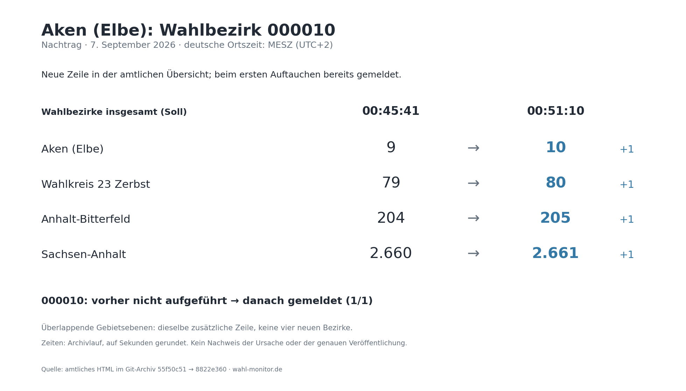

Die Grafik zeigt das Soll auf überlappenden Gebietsebenen. Der Anstieg um eins geht jeweils auf dieselbe neue Zeile zurück. Der Grund ihrer Aufnahme und der genaue Veröffentlichungszeitpunkt bleiben offen.

Belege und genaue HTML-Abrufzeiten: [Detailbericht Aken](AKEN_000010.md) · [Identitätsvergleich](aken_case.json) · [Abruffolge](aken_capture_timeline.csv).
<!-- aken-detail:end -->

## Vollständige Liste: Revisionen bei gleichem Meldestand

Eine Zeile ist eine Gemeinde und ein Übergang zwischen zwei Abrufen. Gezählt werden auch Änderungen einzelner Parteien unterhalb von 5 %. Negative und positive Werte können sich in Summen aufheben.

| Abruf MESZ | Gemeinde | Gemeldet / Soll | Beobachtete Änderungen | Git vorher → nachher |
|---|---|---:|---|---|
| 19:42 | Altmärkische Wische | 5/5 | TIERSCHUTZALLIANZ (Z): 2 → 1 (-1); Tierschutzpartei (Z): 3 → 4 (+1) | [df702e57](https://github.com/volzinnovation/wahl-monitor.de/commit/df702e57eb901e2960903aebb776724d314f051a) → [f6961b47](https://github.com/volzinnovation/wahl-monitor.de/commit/f6961b475040d09ebb7b6629e4706c6537a3ea82) |
| 20:45 | Tangerhütte | 11/21 | CDU (Z): 272 → 273 (+1); AfD (Z): 1179 → 1178 (-1) | [591a63a5](https://github.com/volzinnovation/wahl-monitor.de/commit/591a63a5f78085ff05f6d75f7ae2ed08d028817c) → [25b10630](https://github.com/volzinnovation/wahl-monitor.de/commit/25b1063001e3c81db0ed5c28c39329ce1f820b16) |
| 21:05 | Genthin | 5/14 | dieBasis (Z): 3 → 0 (-3); Tierschutzpartei (Z): 11 → 14 (+3) | [62189838](https://github.com/volzinnovation/wahl-monitor.de/commit/6218983864c2bdf79746be3ce096d1fa5a4cbc04) → [52c22ef4](https://github.com/volzinnovation/wahl-monitor.de/commit/52c22ef400b46584f7fd242cbd63bde9b2e8365b) |
| 21:10 | Oberharz am Brocken | 12/12 | CDU (E): 1418 → 1419 (+1); Die Linke (E): 372 → 373 (+1); GRÜNE (E): 114 → 115 (+1); gültige Erst: 6302 → 6305 (+3) | [52c22ef4](https://github.com/volzinnovation/wahl-monitor.de/commit/52c22ef400b46584f7fd242cbd63bde9b2e8365b) → [71f6ed3c](https://github.com/volzinnovation/wahl-monitor.de/commit/71f6ed3c34a57aa14ffc43e8bbd33b599599307b) |
| 22:11 | Allstedt | 15/15 | AfD (E): 2601 → 2602 (+1); AfD (Z): 2478 → 2479 (+1); gültige Erst: 4841 → 4842 (+1); gültige Zweit: 4857 → 4858 (+1); Wählende: 4910 → 4911 (+1) | [e91d1f5d](https://github.com/volzinnovation/wahl-monitor.de/commit/e91d1f5dd74691f625b5fb7cfd67fa79e34311d1) → [ba1fc517](https://github.com/volzinnovation/wahl-monitor.de/commit/ba1fc517c286fae14ef9d1ae8b573aab69dc9d84) |
| 22:11 | Bad Dürrenberg | 10/10 | Wählende: 6576 → 6534 (-42) | [e91d1f5d](https://github.com/volzinnovation/wahl-monitor.de/commit/e91d1f5dd74691f625b5fb7cfd67fa79e34311d1) → [ba1fc517](https://github.com/volzinnovation/wahl-monitor.de/commit/ba1fc517c286fae14ef9d1ae8b573aab69dc9d84) |
| 22:11 | Aschersleben | 23/26 | Wählende: 11283 → 11284 (+1) | [e91d1f5d](https://github.com/volzinnovation/wahl-monitor.de/commit/e91d1f5dd74691f625b5fb7cfd67fa79e34311d1) → [ba1fc517](https://github.com/volzinnovation/wahl-monitor.de/commit/ba1fc517c286fae14ef9d1ae8b573aab69dc9d84) |
| 22:11 | Annaburg | 14/14 | SPD (E): 151 → 168 (+17); FDP (E): 85 → 68 (-17) | [e91d1f5d](https://github.com/volzinnovation/wahl-monitor.de/commit/e91d1f5dd74691f625b5fb7cfd67fa79e34311d1) → [ba1fc517](https://github.com/volzinnovation/wahl-monitor.de/commit/ba1fc517c286fae14ef9d1ae8b573aab69dc9d84) |
| 22:33 | Mücheln (Geiseltal) | 12/12 | FDP (E): 160 → 164 (+4); GRÜNE (E): 132 → 128 (-4); FDP (Z): 99 → 103 (+4); GRÜNE (Z): 210 → 206 (-4) | [1701369e](https://github.com/volzinnovation/wahl-monitor.de/commit/1701369eb36f9ae3dc5f2d14771ca827fc6a8841) → [5b125408](https://github.com/volzinnovation/wahl-monitor.de/commit/5b1254083eec780de1c02d5990127efb412a5dcd) |
| 22:50 | Quedlinburg | 18/18 | AfD (Z): 6069 → 6068 (-1); Die Linke (Z): 1223 → 1224 (+1) | [56a56a3f](https://github.com/volzinnovation/wahl-monitor.de/commit/56a56a3f176057537914f8050630b42b588b245d) → [4c2543e6](https://github.com/volzinnovation/wahl-monitor.de/commit/4c2543e68df2f3d92b3380232f466993b6c58edd) |
| 22:50 | Südharz | 18/18 | CDU (Z): 1074 → 1073 (-1); FDP (Z): 134 → 133 (-1); gültige Zweit: 5659 → 5657 (-2) | [56a56a3f](https://github.com/volzinnovation/wahl-monitor.de/commit/56a56a3f176057537914f8050630b42b588b245d) → [4c2543e6](https://github.com/volzinnovation/wahl-monitor.de/commit/4c2543e68df2f3d92b3380232f466993b6c58edd) |
| 23:01 | Mücheln (Geiseltal) | 12/12 | CDU (E): 1211 → 1209 (-2); AfD (E): 2956 → 2955 (-1); BSW (Z): 245 → 243 (-2); AfD (Z): 2883 → 2882 (-1); gültige Erst: 5215 → 5212 (-3); gültige Zweit: 5230 → 5227 (-3) | [dabef6e6](https://github.com/volzinnovation/wahl-monitor.de/commit/dabef6e6806d6f4fe0b8399dc468030b204d7c00) → [5f4bd0f6](https://github.com/volzinnovation/wahl-monitor.de/commit/5f4bd0f68143b10399963391191ad7ae267bae10) |
| 23:50 | Naumburg (Saale) | 31/31 | Wählende: 19368 → 19372 (+4) | [22b50c3a](https://github.com/volzinnovation/wahl-monitor.de/commit/22b50c3a50ef24cc5b359b52b9827daad3a65e9c) → [c1b83b22](https://github.com/volzinnovation/wahl-monitor.de/commit/c1b83b22c5edaef8f72537b33e662882fd5eda38) |
| 23:50 | Möser | 9/9 | Wählende: 6039 → 6001 (-38) | [22b50c3a](https://github.com/volzinnovation/wahl-monitor.de/commit/22b50c3a50ef24cc5b359b52b9827daad3a65e9c) → [c1b83b22](https://github.com/volzinnovation/wahl-monitor.de/commit/c1b83b22c5edaef8f72537b33e662882fd5eda38) |
| 00:00 | Gröningen | 6/6 | BSW (E): 130 → 131 (+1); Die Linke (E): 240 → 239 (-1); SPD (E): 142 → 143 (+1); FDP (E): 58 → 57 (-1) | [4df0c5db](https://github.com/volzinnovation/wahl-monitor.de/commit/4df0c5db1901da59dcf29fe843aa883797baf9aa) → [034045f3](https://github.com/volzinnovation/wahl-monitor.de/commit/034045f3d0f71c47aebf3daea47f3d33b136de5c) |

### Rückgänge trotz neuer Meldungen

Ein gleichbleibender Meldestand ist nur ein Detektor. Auch bei zunehmender Meldung sind Rückgänge erkennbar; gleichzeitig positive Änderungen können weitere Revisionen verdecken.

- Selke-Aue, 20:03: party:F9: 8 → 6. Gemeldete Bezirke 3 → 4.
- Wittenberg, 21:27: invalid_votes_erst: 300 → 292; invalid_votes_zweit: 238 → 230. Gemeldete Bezirke 45 → 46.
- Meineweh, 22:11: invalid_votes_zweit: 8 → 6. Gemeldete Bezirke 2 → 3.

## Nächster Lauf und offene Fragen

1. Neue erfolgreich archivierte Git-Referenz auswählen und mit `--require-complete` auswerten. Fehlt noch eine Meldung, bricht die 100%-Freigabe ab.
2. Den Bericht mit `--baseline` gegen diesen Ordner erzeugen; neue Stimmen, neue Revisionen und geschlossene Lücken getrennt ansehen.
3. Sobald Einzelbezirksergebnisse veröffentlicht sind, deren Identitäten, Änderungen und Summen prüfen. Ihr erstmaliges Auftauchen beweist keine rückwirkende Stabilität am Wahlabend.
4. Bei der zuständigen Wahlstelle die dokumentierten Gründe der Statusrücknahme und ausgewählter Korrekturen erfragen. Der Datensatz allein beantwortet diese Frage nicht.

## Grenzen der Aussage

Meldestand ist der Anteil berichteter Bezirke, nicht der Anteil aller zu erwartenden Stimmen. Die >5%-Auswahl basiert auf dem eingefrorenen Landes-Zweitstimmenstand und ist keine Feststellung der rechtlichen Sitzberechtigung. Erststimmen werden zusätzlich in der Ergebnistabelle und im Änderungs-Audit erfasst.

Git enthält erfolgreiche gespeicherte Abrufe, keine lückenlose Aufzeichnung jedes amtlichen Bearbeitungsschritts. Zeitangaben sind Abrufzeiten; tatsächliche Änderungen liegen zwischen den beobachteten Ständen. Eine Rücknahme des Status belegt weder gelöschte Stimmzettel noch Wahlmanipulation. Auch vollständige Summenkonsistenz schließt sachliche Fehler nicht aus.

[Methoden und Reproduktion](METHODS.md) · [Alle Gebiets-/Parteiergebnisse](results_by_area.csv) · [Fehlende Bezirke](missing_wahlbezirke.csv) · [Prüfurteil](VALIDATION.md) · [Detaildiff Bitterfeld-Wolfen](BITTERFELD_WOLFEN_000028.md)
