# Sachsen-Anhalt 2026: Auswertung der vollständigen Git-Historie

## Executive Summary

- **Der gesamte verfügbare LSA-Datenverlauf wurde neu ausgewertet:** 123 Daten-Commits, 121 datierte Abrufe einschließlich 3 Nullvorlagen, dazu 2 Einrichtungsschritte ohne Abrufzeit. Ende: **07.09.2026, 03:10:11 MESZ**. Polling ist gestoppt.
- **Neue Befunde gegenüber dem Mitternachtsbericht:** fünf weitere Gemeinderevisionen; insgesamt **20 Änderungen in 19 Gemeinden**, davon 17 nach vollständiger Meldung. Die eine Statusrücknahme in Bitterfeld-Wolfen bleibt bestehen; Aken 000010 erhöht das Soll um eins.
- **Die letzten Quellen sind nicht vollständig konsistent:** HTML und Gemeinde-CSV melden 2.661/2.661, die Landes-CSV 2.660/2.661. Die Gemeindesumme enthält **1.513 gültige Zweitstimmen mehr**; alle Differenzen entsprechen dem neuen Aschersleben-Zuwachs.
- **Keine Rechenfehler innerhalb der geprüften Zeilen, aber eine Aggregationslücke:** 162 nicht-null Feldvergleiche wiederholen dieselbe Lücke in drei Ständen. Diese Beobachtungen belegen weder ihre Ursachen noch Wahlmanipulation.

Git-Endpunkt: `23377a96d918a4b77f71dbabbf9c385f78334126`. Alle Zeitangaben sind deutsche Ortszeit **MESZ (UTC+2)**. Dies ersetzt den bisherigen Bericht inhaltlich durch eine vollständige Neuberechnung, ist aber kein amtliches Endergebnis. Die Parteiauswahl >5 % und Landesanteile beziehen sich auf die amtliche Landes-CSV; eigene Gemeindesummen sind gesondert bezeichnet.

## Tweet-Serie mit Bildern

Jeder nummerierte Absatz ist ein separater Entwurf mit maximal 280 gewichteten Zeichen. Belege, Bildtexte und ergänzende Erklärungen gehören zur Berichtskopie.

### Tweet 1

1/19 LSA: Polling beendet. Vollständige Git-Historie bis 07.09.2026, 03:10 MESZ: 123 Daten-Commits, 121 datierte Abrufe, davon 118 am Wahlabend/in der Nacht. Alle Zahlen und Grafiken wurden neu berechnet.

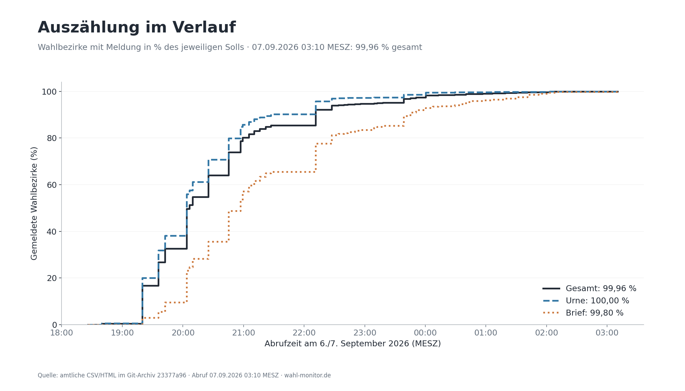

Belege: [history_inventory.csv](history_inventory.csv), [polling_stopped.json](polling_stopped.json).

### Tweet 2

2/19 Letzter Stand: HTML und Gemeinde-CSV 2.661/2.661 Bezirke gemeldet; Landes-CSV 2.660/2.661 (99,96 %). Vollständige Statusmeldungen bedeuten hier noch keine übereinstimmenden Stimmenaggregate. Kein amtliches Endergebnis.

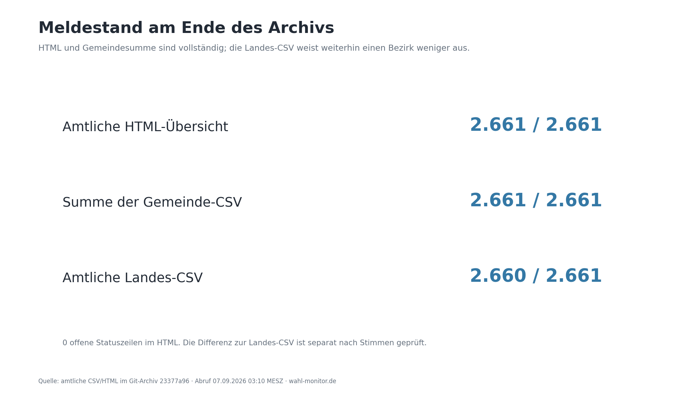

Belege: [summary.json](summary.json), [aggregation_gap.json](aggregation_gap.json).

### Tweet 3

3/19 Zweitstimmen der amtlichen Landes-CSV: AfD 43,82 %, CDU 17,22 %, SPD 9,29 %, GRÜNE 8,93 %, Die Linke 8,55 %, BSW 5,26 %. Auswahl: strikt über 5 %; Nenner sind alle gültigen Zweitstimmen.

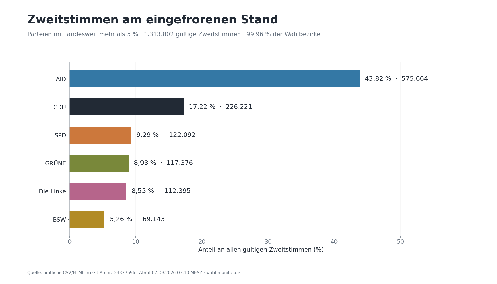

Belege: [summary.json](summary.json).

### Tweet 4

4/19 Ab 03:04 MESZ: Gemeindesumme 1.315.315 gültige Zweitstimmen, Landes-CSV 1.313.802. Differenz +1.513, bis 03:10 unverändert. Sie entspricht exakt dem neuen Gemeindezuwachs in Aschersleben.

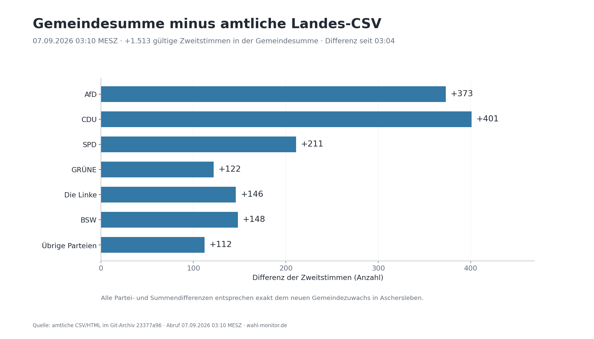

Belege: [aggregation_gap.json](aggregation_gap.json), [AGGREGATION_ASCHERSLEBEN.md](AGGREGATION_ASCHERSLEBEN.md).

### Tweet 5

5/19 Gemeindesumme minus Landes-CSV, Zweitstimmen: CDU +401, AfD +373, SPD +211, BSW +148, Linke +146, GRÜNE +122, übrige +112. Eine Aggregationslücke in den veröffentlichten Dateien; kein Beleg für verlorene Stimmzettel.

Belege: [land_vs_municipality_parties.csv](land_vs_municipality_parties.csv).

### Tweet 6

6/19 Magdeburg, Halle und Dessau-Roßlau im Vergleich mit den übrigen 215 Gemeinden. Die übrigen Gemeinden werden nach Stimmen gewichtet. Gemeindezahlen enthalten den späteren Aschersleben-Zuwachs; die amtliche Landes-CSV noch nicht.

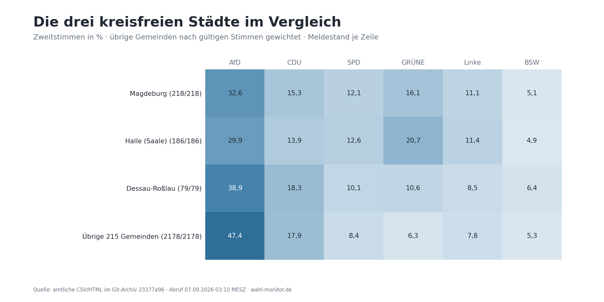

Belege: [results_by_area.csv](results_by_area.csv), [aggregation_gap.json](aggregation_gap.json).

### Tweet 7

7/19 Alle 14 Kreise/kreisfreien Städte: dieselbe landesweite Parteiauswahl, lokale Anteile unter 5 % bleiben sichtbar. Überlappende Gebietsebenen werden nicht addiert. Der Salzlandkreis bleibt im höheren CSV-Aggregat bei 193/194 Meldungen.

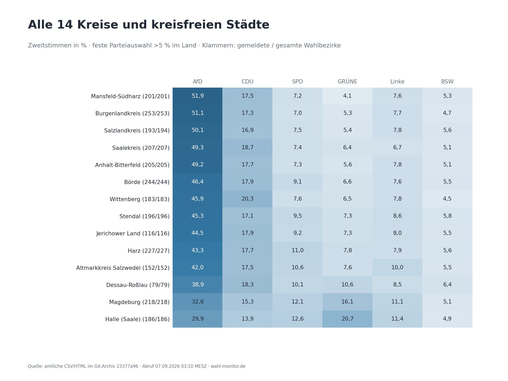

Belege: [results_by_area.csv](results_by_area.csv).

### Tweet 8

8/19 Alle 41 Wahlkreise und die Streuung in 218 Gemeinden. Wahlkreise stammen direkt aus dem amtlichen Export; geteilte Gemeinden werden nicht pauschal zugeordnet. Regionale Unterschiede allein belegen keine Unregelmäßigkeit.

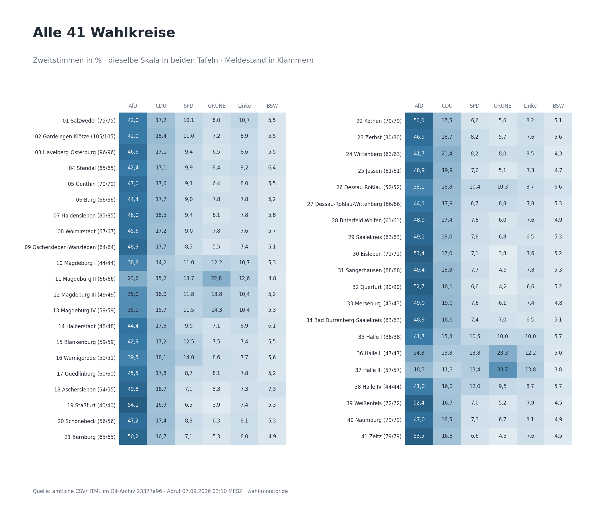

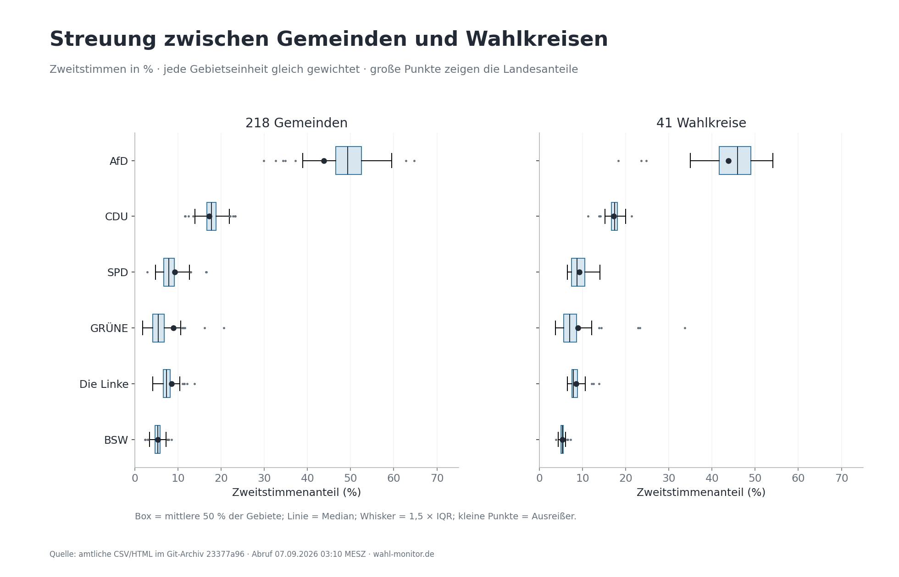

Belege: [results_by_area.csv](results_by_area.csv).

### Tweet 9

9/19 Landes-CSV: Urne 2150/2150, Brief 510/511. Der offene Zähler liegt bei der Briefwahl. Die erfassten Parteianteile unterscheiden sich nach Wahltyp; dies ist keine Prognose.

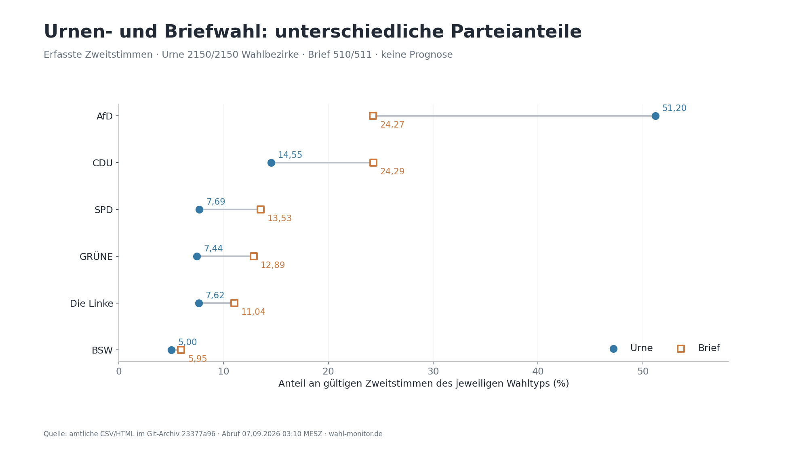

Belege: [latest_official_rows.json](latest_official_rows.json).

### Tweet 10

10/19 Der Parteiverlauf zeigt die Zusammensetzung eingehender Meldungen, keine wechselnden Wählerpräferenzen. Frühe Ergebnisse sind selektiv. Die Kurven zeigen die Wahlnacht; frühere Nullvorlagen bleiben im vollständigen Daten-Audit.

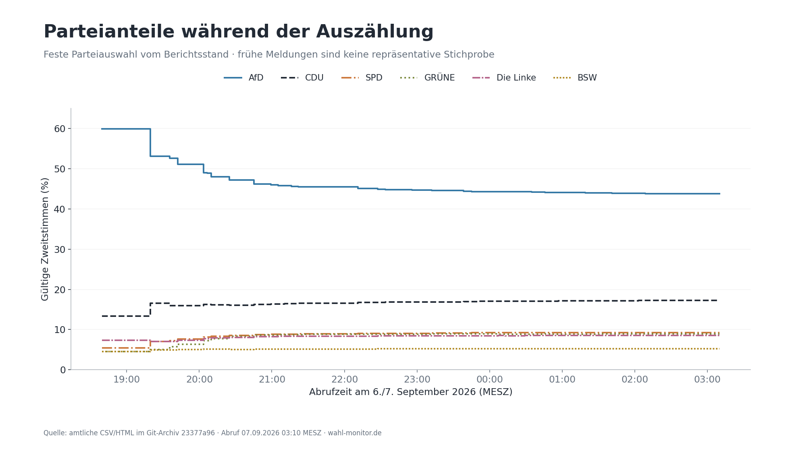

Belege: [raw_timeline.jsonl.gz](raw_timeline.jsonl.gz), [history_inventory.csv](history_inventory.csv).

### Tweet 11

11/19 Bitterfeld-Wolfen / 000028: gemeldet, ab 19:35 wieder nicht gemeldet, ab 22:11 erneut gemeldet. Es bleibt die einzige beobachtete Statusrücknahme. Einzelstimmen dieses Bezirks wurden nicht archiviert.

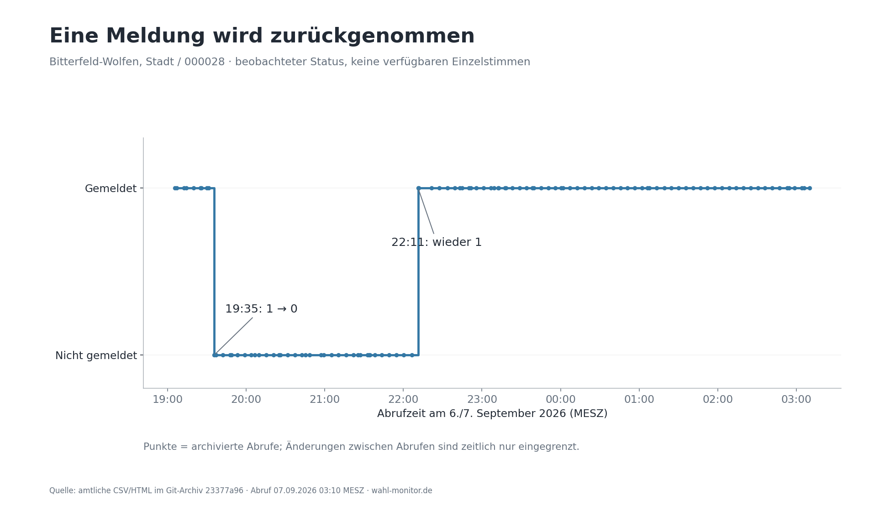

Belege: [summary.json](summary.json), [BITTERFELD_WOLFEN_000028.md](BITTERFELD_WOLFEN_000028.md).

### Tweet 12

12/19 Vollständige Historie: 20 Änderungen in 19 Gemeinden bei gleicher Zahl gemeldeter Bezirke; 17 nach vollständiger Meldung. Seit dem Bericht um 00:00 kommen fünf hinzu. Alle Parteien werden im Änderungs-Audit geprüft.

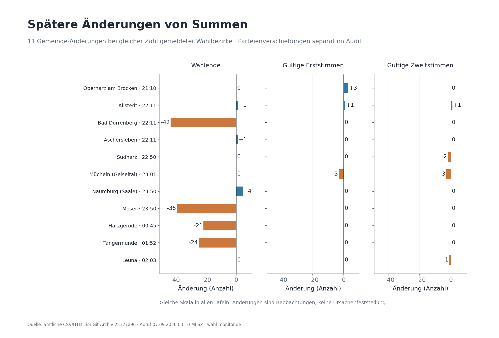

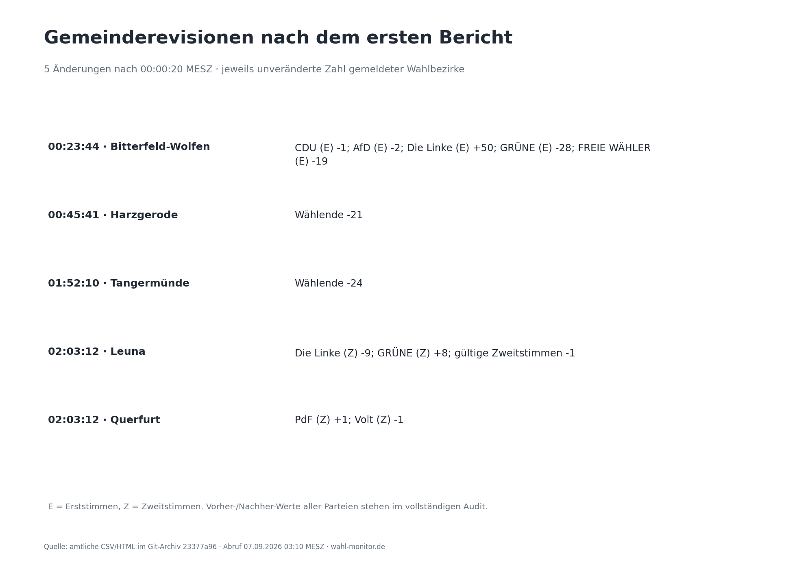

Belege: [summary.json](summary.json), [post_midnight_revisions.json](post_midnight_revisions.json).

### Tweet 13

13/19 Bitterfeld-Wolfen, 00:23 MESZ: Erststimmen Linke +50, GRÜNE −28, FREIE WÄHLER −19, AfD −2, CDU −1. Summe unverändert, 31/31 Bezirke gemeldet. Ein späterer Gemeinde-Diff; Bezirk 000028 ist damit nicht als Ursache identifiziert.

Belege: [post_midnight_revisions.json](post_midnight_revisions.json).

### Tweet 14

14/19 Weitere spätere Änderungen: Harzgerode −21 Wählende, Tangermünde −24. Leuna: Linke −9 und GRÜNE +8 Zweitstimmen, gültige Summe −1. Querfurt: PdF +1, Volt −1 Zweitstimme. Ursachen sind nicht dokumentiert.

Belege: [post_midnight_revisions.json](post_midnight_revisions.json), [raw_candidate_events.csv](raw_candidate_events.csv).

### Tweet 15

15/19 Aken (Elbe) / 000010 erscheint neu: 00:45:41 MESZ noch nicht aufgeführt, um 00:51:10 bereits gemeldet. Das Soll steigt 2.660 → 2.661. Aken 9 → 10, Wahlkreis Zerbst 79 → 80, Anhalt-Bitterfeld 204 → 205. Keine Identität entfernt.

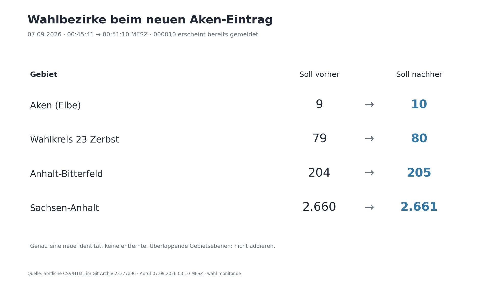

Belege: [AKEN_000010.md](AKEN_000010.md), [district_identity_changes.json](district_identity_changes.json).

### Tweet 16

16/19 Prüfung: 575 Quellen per SHA-256 bestätigt; keine Fehler innerhalb der Zeilensummen und keine Abweichung zwischen Export und Quell-CSV. 162 geografische Feldabweichungen betreffen dieselbe Aschersleben-Lücke in drei Ständen.

Belege: [aggregation_nonzero.csv](aggregation_nonzero.csv), [source_manifest.json](source_manifest.json), [summary.json](summary.json).

### Tweet 17

17/19 HTML und CSV sind nicht immer synchron: 25 von 110 gemeinsamen Abrufen unterscheiden sich beim Meldestand. Zuletzt zeigt HTML keinen offenen Bezirk. Für die Stimmen bleibt der dokumentierte Unterschied zwischen den CSV-Ebenen.

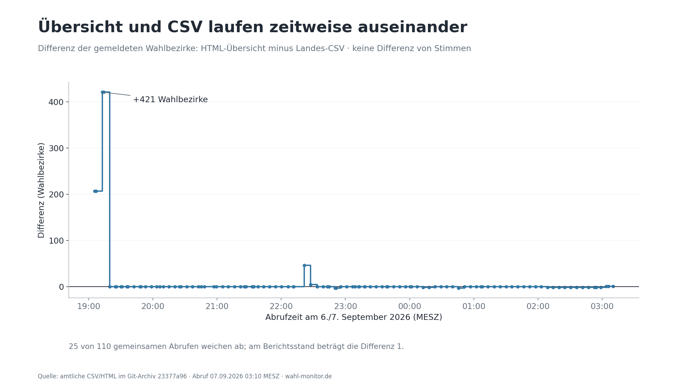

Belege: [versions.csv](versions.csv), [aggregation_gap.json](aggregation_gap.json).

### Tweet 18

18/19 Grenzen: Für 0 Bezirke liegen Einzelstimmen vor; die Statushistorie beginnt um 19:05. Drei frühere Nullvorlagen und zwei Einrichtungsschritte sind inventarisiert. Änderungen zwischen Abrufen und ausgleichende Korrekturen können unsichtbar bleiben.

Belege: [history_inventory.csv](history_inventory.csv), [summary.json](summary.json).

### Tweet 19

19/19 Die Erfassung ist gestoppt; es ist kein weiterer Abruf geplant. Offen bleiben amtliche Erklärungen zur Rücknahme, zu Korrekturen, zum Aken-Eintrag und zur Aggregationslücke. Das Archiv belegt Datenänderungen, nicht deren Ursache oder Wahlmanipulation.

Belege: [polling_stopped.json](polling_stopped.json), [METHODS.md](METHODS.md).

## CSV-Aggregation: Aschersleben wird noch nicht vollständig fortgeschrieben

Die höheren CSV-Aggregate stimmen untereinander überein; die Gemeinde-CSV ist im letzten Übergang weiter. Seit 03:04 liegt ihre Summe um 1 gemeldeten Bezirk, 1.517 Wählende, 1.509 gültige Erst- und 1.513 gültige Zweitstimmen über dem Landeswert. Dieselben 27 Felddifferenzen erscheinen Gemeinde → Salzlandkreis und Gemeinde → Land, in drei gespeicherten Ständen. Eine wiederholte Summenfortschreibung ist kein unabhängiger Vorfall.

[Alle Parteien und Vorher-/Nachher-Summen](AGGREGATION_ASCHERSLEBEN.md). Die mathematische Übereinstimmung mit Ascherslebens neuem Gemeindezuwachs ist belegt. Ein späterer amtlicher Abgleich kann die Ursache klären; das gestoppte Archiv enthält ihn nicht.

## Neuer Bezirkseintrag: Aken 000010

Die vollständige Identität kommt einmal hinzu; kein Bezirkseintrag verschwindet. Der Nenner steigt von 2.660 auf 2.661. Die Zahl 2.660 im älteren Bericht war für dessen Zeitpunkt korrekt. Aken steigt gleichzeitig um 435 gültige Zweitstimmen; dieser Zuwachs wird damals über alle höheren Ebenen konsistent fortgeschrieben.

[Genaue Abrufzeiten, Identitäten und Summen](AKEN_000010.md). Der Grund für das zusätzliche Soll ist nicht dokumentiert.

## Vollständige Liste: Revisionen bei gleichem Meldestand

Eine Zeile ist eine Gemeinde und ein Übergang zwischen zwei Abrufen. Gezählt werden auch Änderungen einzelner Parteien unterhalb von 5 %. Negative und positive Werte können sich in Summen aufheben.

| Abruf MESZ | Gemeinde | Gemeldet / Soll | Beobachtete Änderungen | Git vorher → nachher |
|---|---|---:|---|---|
| 19:42 | Altmärkische Wische | 5/5 | TIERSCHUTZALLIANZ (Z): 2 → 1 (-1); Tierschutzpartei (Z): 3 → 4 (+1) | [df702e57](https://github.com/volzinnovation/wahl-monitor.de/commit/df702e57eb901e2960903aebb776724d314f051a) → [f6961b47](https://github.com/volzinnovation/wahl-monitor.de/commit/f6961b475040d09ebb7b6629e4706c6537a3ea82) |
| 20:45 | Tangerhütte | 11/21 | CDU (Z): 272 → 273 (+1); AfD (Z): 1179 → 1178 (-1) | [591a63a5](https://github.com/volzinnovation/wahl-monitor.de/commit/591a63a5f78085ff05f6d75f7ae2ed08d028817c) → [25b10630](https://github.com/volzinnovation/wahl-monitor.de/commit/25b1063001e3c81db0ed5c28c39329ce1f820b16) |
| 21:05 | Genthin | 5/14 | dieBasis (Z): 3 → 0 (-3); Tierschutzpartei (Z): 11 → 14 (+3) | [62189838](https://github.com/volzinnovation/wahl-monitor.de/commit/6218983864c2bdf79746be3ce096d1fa5a4cbc04) → [52c22ef4](https://github.com/volzinnovation/wahl-monitor.de/commit/52c22ef400b46584f7fd242cbd63bde9b2e8365b) |
| 21:10 | Oberharz am Brocken | 12/12 | CDU (E): 1418 → 1419 (+1); Die Linke (E): 372 → 373 (+1); GRÜNE (E): 114 → 115 (+1); gültige Erst: 6302 → 6305 (+3) | [52c22ef4](https://github.com/volzinnovation/wahl-monitor.de/commit/52c22ef400b46584f7fd242cbd63bde9b2e8365b) → [71f6ed3c](https://github.com/volzinnovation/wahl-monitor.de/commit/71f6ed3c34a57aa14ffc43e8bbd33b599599307b) |
| 22:11 | Allstedt | 15/15 | AfD (E): 2601 → 2602 (+1); AfD (Z): 2478 → 2479 (+1); gültige Erst: 4841 → 4842 (+1); gültige Zweit: 4857 → 4858 (+1); Wählende: 4910 → 4911 (+1) | [e91d1f5d](https://github.com/volzinnovation/wahl-monitor.de/commit/e91d1f5dd74691f625b5fb7cfd67fa79e34311d1) → [ba1fc517](https://github.com/volzinnovation/wahl-monitor.de/commit/ba1fc517c286fae14ef9d1ae8b573aab69dc9d84) |
| 22:11 | Bad Dürrenberg | 10/10 | Wählende: 6576 → 6534 (-42) | [e91d1f5d](https://github.com/volzinnovation/wahl-monitor.de/commit/e91d1f5dd74691f625b5fb7cfd67fa79e34311d1) → [ba1fc517](https://github.com/volzinnovation/wahl-monitor.de/commit/ba1fc517c286fae14ef9d1ae8b573aab69dc9d84) |
| 22:11 | Aschersleben | 23/26 | Wählende: 11283 → 11284 (+1) | [e91d1f5d](https://github.com/volzinnovation/wahl-monitor.de/commit/e91d1f5dd74691f625b5fb7cfd67fa79e34311d1) → [ba1fc517](https://github.com/volzinnovation/wahl-monitor.de/commit/ba1fc517c286fae14ef9d1ae8b573aab69dc9d84) |
| 22:11 | Annaburg | 14/14 | SPD (E): 151 → 168 (+17); FDP (E): 85 → 68 (-17) | [e91d1f5d](https://github.com/volzinnovation/wahl-monitor.de/commit/e91d1f5dd74691f625b5fb7cfd67fa79e34311d1) → [ba1fc517](https://github.com/volzinnovation/wahl-monitor.de/commit/ba1fc517c286fae14ef9d1ae8b573aab69dc9d84) |
| 22:33 | Mücheln (Geiseltal) | 12/12 | FDP (E): 160 → 164 (+4); GRÜNE (E): 132 → 128 (-4); FDP (Z): 99 → 103 (+4); GRÜNE (Z): 210 → 206 (-4) | [1701369e](https://github.com/volzinnovation/wahl-monitor.de/commit/1701369eb36f9ae3dc5f2d14771ca827fc6a8841) → [5b125408](https://github.com/volzinnovation/wahl-monitor.de/commit/5b1254083eec780de1c02d5990127efb412a5dcd) |
| 22:50 | Quedlinburg | 18/18 | AfD (Z): 6069 → 6068 (-1); Die Linke (Z): 1223 → 1224 (+1) | [56a56a3f](https://github.com/volzinnovation/wahl-monitor.de/commit/56a56a3f176057537914f8050630b42b588b245d) → [4c2543e6](https://github.com/volzinnovation/wahl-monitor.de/commit/4c2543e68df2f3d92b3380232f466993b6c58edd) |
| 22:50 | Südharz | 18/18 | CDU (Z): 1074 → 1073 (-1); FDP (Z): 134 → 133 (-1); gültige Zweit: 5659 → 5657 (-2) | [56a56a3f](https://github.com/volzinnovation/wahl-monitor.de/commit/56a56a3f176057537914f8050630b42b588b245d) → [4c2543e6](https://github.com/volzinnovation/wahl-monitor.de/commit/4c2543e68df2f3d92b3380232f466993b6c58edd) |
| 23:01 | Mücheln (Geiseltal) | 12/12 | CDU (E): 1211 → 1209 (-2); AfD (E): 2956 → 2955 (-1); BSW (Z): 245 → 243 (-2); AfD (Z): 2883 → 2882 (-1); gültige Erst: 5215 → 5212 (-3); gültige Zweit: 5230 → 5227 (-3) | [dabef6e6](https://github.com/volzinnovation/wahl-monitor.de/commit/dabef6e6806d6f4fe0b8399dc468030b204d7c00) → [5f4bd0f6](https://github.com/volzinnovation/wahl-monitor.de/commit/5f4bd0f68143b10399963391191ad7ae267bae10) |
| 23:50 | Naumburg (Saale) | 31/31 | Wählende: 19368 → 19372 (+4) | [22b50c3a](https://github.com/volzinnovation/wahl-monitor.de/commit/22b50c3a50ef24cc5b359b52b9827daad3a65e9c) → [c1b83b22](https://github.com/volzinnovation/wahl-monitor.de/commit/c1b83b22c5edaef8f72537b33e662882fd5eda38) |
| 23:50 | Möser | 9/9 | Wählende: 6039 → 6001 (-38) | [22b50c3a](https://github.com/volzinnovation/wahl-monitor.de/commit/22b50c3a50ef24cc5b359b52b9827daad3a65e9c) → [c1b83b22](https://github.com/volzinnovation/wahl-monitor.de/commit/c1b83b22c5edaef8f72537b33e662882fd5eda38) |
| 00:00 | Gröningen | 6/6 | BSW (E): 130 → 131 (+1); Die Linke (E): 240 → 239 (-1); SPD (E): 142 → 143 (+1); FDP (E): 58 → 57 (-1) | [4df0c5db](https://github.com/volzinnovation/wahl-monitor.de/commit/4df0c5db1901da59dcf29fe843aa883797baf9aa) → [034045f3](https://github.com/volzinnovation/wahl-monitor.de/commit/034045f3d0f71c47aebf3daea47f3d33b136de5c) |
| 00:23 | Bitterfeld-Wolfen | 31/31 | CDU (E): 4315 → 4314 (-1); AfD (E): 11015 → 11013 (-2); Die Linke (E): 2227 → 2277 (+50); GRÜNE (E): 732 → 704 (-28); FREIE WÄHLER (E): 945 → 926 (-19) | [82b74514](https://github.com/volzinnovation/wahl-monitor.de/commit/82b745143ae58288ad021a5f17a786d53eece813) → [305df692](https://github.com/volzinnovation/wahl-monitor.de/commit/305df69296afee6657b419df62f861403fd4370e) |
| 00:45 | Harzgerode | 13/13 | Wählende: 4841 → 4820 (-21) | [937eaa10](https://github.com/volzinnovation/wahl-monitor.de/commit/937eaa10aa40ba789d0dd62ff5de859dc6ef9e86) → [55f50c51](https://github.com/volzinnovation/wahl-monitor.de/commit/55f50c51b9dfac63ad15cb2b7b2ff314eefdf062) |
| 01:52 | Tangermünde | 14/14 | Wählende: 6991 → 6967 (-24) | [8498858d](https://github.com/volzinnovation/wahl-monitor.de/commit/8498858d5feb8fd3e85f08ed011bc269ae59a984) → [b91a617a](https://github.com/volzinnovation/wahl-monitor.de/commit/b91a617a4db6dda78f75a03ea2f293889c1763ea) |
| 02:03 | Leuna | 14/14 | Die Linke (Z): 585 → 576 (-9); GRÜNE (Z): 455 → 463 (+8); gültige Zweit: 8981 → 8980 (-1) | [bcef1b09](https://github.com/volzinnovation/wahl-monitor.de/commit/bcef1b09bad690c72a89f6812b476fb7df5269ce) → [d7cec411](https://github.com/volzinnovation/wahl-monitor.de/commit/d7cec4116047ffe4e392c29511dcafc9c92d55c8) |
| 02:03 | Querfurt | 16/16 | PdF (Z): 26 → 27 (+1); Volt (Z): 14 → 13 (-1) | [bcef1b09](https://github.com/volzinnovation/wahl-monitor.de/commit/bcef1b09bad690c72a89f6812b476fb7df5269ce) → [d7cec411](https://github.com/volzinnovation/wahl-monitor.de/commit/d7cec4116047ffe4e392c29511dcafc9c92d55c8) |

### Rückgänge trotz neuer Meldungen

Ein gleichbleibender Meldestand ist nur ein Detektor. Auch bei zunehmender Meldung sind Rückgänge erkennbar; gleichzeitig positive Änderungen können weitere Revisionen verdecken.

- Selke-Aue, 20:03: party:F9: 8 → 6. Gemeldete Bezirke 3 → 4.
- Wittenberg, 21:27: invalid_votes_erst: 300 → 292; invalid_votes_zweit: 238 → 230. Gemeldete Bezirke 45 → 46.
- Meineweh, 22:11: invalid_votes_zweit: 8 → 6. Gemeldete Bezirke 2 → 3.

## Umfang und Prüfgrenzen

Die Historie umfasst alle 123 Änderungen des LSA-Latest-Datenverzeichnisses im erreichbaren Git-Verlauf bis zum festgehaltenen Endpunkt. Die vollständige und die First-Parent-Aufzählung enthalten dieselben Daten-Commits. Von 121 datierten Abrufen liegen drei vor Öffnung der Auszählung; sie enthalten keine Stimmen. Die Zeitdiagramme konzentrieren sich auf die 118 Abrufe ab 18:00, der Daten-Audit enthält auch die frühen Vorlagen. Zwei Einrichtungsschritte ohne Abrufzeit sind im Inventar ausgewiesen.

Bei 1 früher Nullvorlage fehlt die ursprüngliche Quell-CSV; der normalisierte Export ist im Git vorhanden und geprüft. Alle 575 erhaltenen Quellobjekte der übrigen Abrufe wurden gegen ihre gespeicherten SHA-256 geprüft. Die Statushistorie beginnt erst um 19:05; Einzelstimmen je Wahlbezirk fehlen vollständig.

Gleicher Meldestand ist nur ein Änderungsdetektor. Korrekturen können gleichzeitig mit neuen Meldungen auftreten oder sich zwischen Abrufen ausgleichen. Die Aken-Sollerhöhung zählt daher gesondert und nicht als eine der 20 Revisionen bei festem Meldestand. Regionale Unterschiede und vollständige Arithmetik sind für sich weder Beleg noch Ausschluss sachlicher Wahlfehler.

## Erfassung beendet und offene Fragen

Die Codex-Automation ist pausiert; der GitHub-Workflow „Archive Sachsen-Anhalt 2026“ ist manuell deaktiviert. Bei der Abschlusskontrolle war kein Sammellauf mehr aktiv oder vorgemerkt. Es ist kein weiterer Abruf geplant.

Die offenen Fragen betreffen die amtliche Begründung der Statusrücknahme, die dokumentierten Gemeindekorrekturen, die Aufnahme von Aken 000010 und den Abgleich der Aschersleben-Summen. Für eine spätere weitere Datenerfassung ist eine neue Anweisung nötig.

[Methoden und Reproduktion](METHODS.md) · [Prüfurteil](VALIDATION.md) · [Git-Inventar](history_inventory.csv) · [Alle Gebiets-/Parteiergebnisse](results_by_area.csv) · [Bitterfeld-Detaildiff](BITTERFELD_WOLFEN_000028.md) · [Erfassung gestoppt](polling_stopped.json)

## Vergleich zum ursprünglichen Bericht

Gegenüber 00:00:20 MESZ wurden 38 spätere Abrufe und zusätzlich drei frühere Nullvorlagen einbezogen. 5 neue Revisionen bei festem Meldestand, ein zusätzliches Soll und die neue Aggregationslücke sind in der Neuberechnung enthalten. Alle 46 zuvor offenen HTML-Statusmeldungen sind nun geschlossen.

[Vollständiger Vergleich einschließlich Parteistimmen und Anteilsänderungen](comparison.json)
