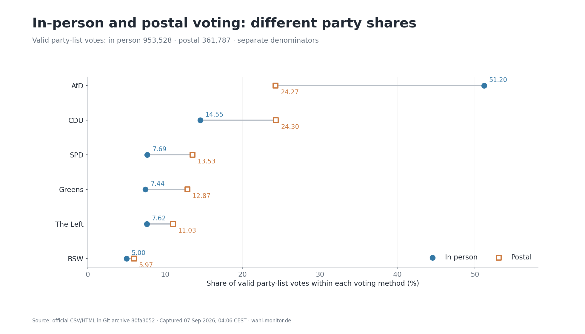

# English translation of chart 11



“Party-list votes” translates Zweitstimmen. In-person voting corresponds to
Urnenwahl, and postal voting to Briefwahl. All 12 plotted values, party order,
scales, colours and marker styles match the German chart. Labels use English
number formatting; Greens and The Left translate GRÜNE and Die Linke.

Reproduce from the repository root:

```sh
python3 scripts/render_lsa_voting_mode_english.py
```

[Plotted data](11_urne_brief.csv) · [Source and output hashes](manifest.json)
