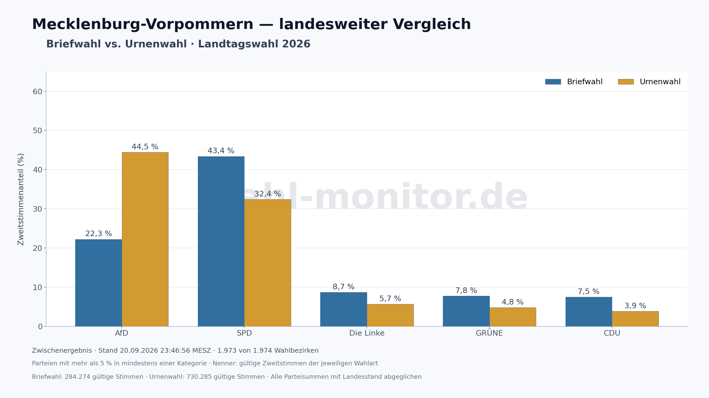

# Mecklenburg-Vorpommern: Briefwahl und Urnenwahl 2026

Die größten Unterschiede unter den dargestellten Parteien: **SPD liegt bei der Briefwahl um 11,00 Prozentpunkte höher**, **AfD um 22,20 Prozentpunkte niedriger** als bei der Urnenwahl.

**Zwischenergebnis, Stand 20.09.2026 23:46:56 MESZ: 1.973 von 1.974 Wahlbezirken.** Die Auszählung ist noch nicht vollständig; spätere Meldungen können die Anteile verändern.



| Partei | Briefwahl | Urnenwahl | Brief minus Urne (Prozentpunkte) |
|---|---:|---:|---:|
| AfD | 22,25 % | 44,46 % | -22.20 |
| SPD | 43,41 % | 32,41 % | +11.00 |
| Die Linke | 8,74 % | 5,68 % | +3.06 |
| GRÜNE | 7,80 % | 4,83 % | +2.97 |
| CDU | 7,48 % | 3,88 % | +3.60 |

[PNG](briefwahl-vs-urnenwahl.png) · [SVG](briefwahl-vs-urnenwahl.svg) · [CSV mit allen verfügbaren Kategorien](briefwahl-vs-urnenwahl.csv)

## Einordnung und Methode

Wie beim Vergleich für Wahlkreis 14 werden Parteien mit mehr als 5 % in mindestens einer Wahlart gezeigt. Jeder Anteil bezieht sich auf **alle gültigen Zweitstimmen der jeweiligen Wahlart**, einschließlich nicht gezeigter Parteien. Die Differenz ist Briefwahl minus Urnenwahl in Prozentpunkten.

Die Stimmen aller 1.974 Wahlbezirke wurden je Wahlart summiert und sowohl insgesamt als auch für jede Partei mit dem Landesstand abgeglichen. Briefwahl wird über die amtliche Wahlbezirksbezeichnung erkannt und zusätzlich anhand der Wahlberechtigtenzahl null geprüft. Wahlbezirke ohne bisher gültige Stimmen tragen null Stimmen bei; das ist kein abgeschlossenes Nullergebnis. Stimmengewichtete Anteile, keine Mittelwerte von Wahlbezirksprozenten. `precincts.csv` enthält die Kontrollsummen und Stimmen je Wahlbezirk.

Die Unterschiede beschreiben die bisher ausgezählten Wählergruppen. Sie belegen keinen kausalen Einfluss der Wahlart auf die Parteiwahl. Unterschiede in der Zusammensetzung und im Meldestand der Gruppen werden hier nicht statistisch bereinigt.

## Quelle und Reproduktion

[Amtliche Quelle](https://wahlen.mvnet.de/dateien/ergebnisse.2026/landtagswahl/csv/l_wahlbezirke.csv); eingefrorene Eingabedateien und SHA-256 in `sources/acquisition.json`, Prüfungen in `manifest.json`.
Der Berliner Vergleich kann einen anderen Quellenstand als das Git-basierte Video haben; die Zeitangaben sind für jedes Artefakt separat ausgewiesen.

```sh
python3 scripts/analyze_state_voting_modes.py --election 2026-mv --source-dir data/2026-mv/reports/statewide-voting-modes-60845e75/sources --output /tmp/2026-mv-voting-modes
```

Dependencies: Python, Matplotlib, BeautifulSoup and the repository poller parser. Replay uses saved sources without fetching or polling. No deployment is performed.
